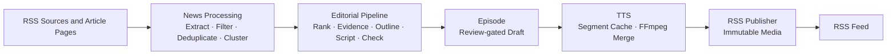

# DailyCast

An autonomous AI podcast generation platform that collects information sources, performs AI editorial workflows, generates audio, and publishes podcasts automatically.

DailyCast is a self-hosted, single-process Python application for producing a review-gated personal news podcast. It keeps task state in SQLite, media on the filesystem, and publishes approved episodes through a self-hosted RSS feed.

## Features

- RSS and web news collection: RSS discovery plus safe HTTP extraction of linked article pages
- Deterministic filtering, exact/near deduplication, and TF-IDF event clustering
- LLM editorial workflow for ranking, evidence dossiers, outlines, scripts, metadata, and review
- Structured script generation and validation before an episode can be created
- Schema-validated LLM result caching with complete semantic cache identities
- Configurable TTS generation with resumable audio-segment caching
- FFmpeg audio assembly into a checksum-verified draft MP3
- Immutable public audio assets and self-hosted RSS podcast publishing
- Docker Compose deployment with SQLite migrations and health checks

## Architecture



## Current Status

**DailyCast v0.1 Alpha**

Completed:

- [x] News ingestion
- [x] News processing
- [x] LLM editorial workflow
- [x] Script generation
- [x] TTS generation
- [x] RSS publishing
- [x] Docker deployment

Generated episodes remain review-gated. Automatic publishing is disabled by default and only an approved episode with valid audio can become public.

## Quick Start

Requirements: Docker Engine or Docker Desktop with Docker Compose.

```bash
git clone https://github.com/<your-account>/dailycast.git
cd dailycast
cp .env.example .env
```

Edit `.env` for environment-specific values and review `config/app.example.yaml` and `config/sources.example.yaml`. Set `DAILYCAST_LLM__API_KEY` only in your local `.env` or deployment environment; never put it in YAML or commit it.

Start the service:

```bash
docker compose up --build
```

The container runs `alembic upgrade head` before starting the application. A failed migration stops the container.

Check service health:

```bash
curl http://127.0.0.1:8000/healthz
curl http://127.0.0.1:8000/readyz
```

The Feed URL is `http://127.0.0.1:8000/feed.xml`. It returns `404` until at least one approved episode has been successfully published. Docker Compose maps the management service to `127.0.0.1:8000` by default; publishing a Feed does not make the management API public.

`data/` is the private runtime volume for SQLite and task artifacts. `public/` contains the generated Feed and immutable media assets. Neither directory should be committed.

## Configuration

DailyCast uses two configuration layers:

- `.env` holds environment-specific values and secrets. Start with `.env.example`; its LLM API-key value is intentionally blank.
- `config/app.example.yaml` contains non-secret application, database, processing, LLM, TTS, FFmpeg, scheduler, and RSS defaults.
- `config/sources.example.yaml` shows the RSS source format. For Alpha, treat it as a configuration reference and do not store credentials in source configuration.

Environment variables override YAML. `DATA_DIR` and `PUBLIC_DIR` select the runtime roots for local development; Compose also provides `DAILYCAST_DATA_DIR` and `DAILYCAST_PUBLIC_DIR` for the host-side volume paths.

For a non-loopback public Feed, configure an explicit HTTPS `DAILYCAST_PUBLISHING__PUBLIC_BASE_URL` and expose only the intended Feed/media paths through your reverse proxy or static hosting setup.

## Development

Requirements: Python 3.12 and Poetry.

```bash
poetry install --with dev
poetry run alembic upgrade head
```

Run the quality suite:

```bash
poetry run ruff check .
poetry run black --check .
poetry run mypy src
poetry run pytest -q
```

The Docker startup test starts a real Compose project and is opt-in locally:

```bash
DAILYCAST_RUN_DOCKER_TEST=1 poetry run pytest -q tests/integration/test_docker_startup.py
```

## Roadmap

- [x] Alpha pipeline
- [ ] Web dashboard
- [ ] Zeabur one-click deployment
- [ ] Dify workflow provider
- [ ] n8n integration
- [ ] RPA publisher
- [ ] Multi-model support

The Alpha does not include a web dashboard, Dify, n8n, RPA publishing, multi-user accounts, or SaaS functionality.

## License

DailyCast is released under the [MIT License](LICENSE).
