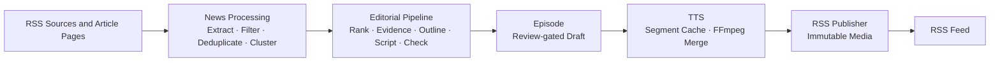

# DailyCast

An autonomous AI podcast generation platform that collects information sources, performs AI editorial workflows, generates audio, and publishes podcasts automatically.

DailyCast is a self-hosted, single-process Python application for producing a review-gated personal news podcast. It keeps task state in SQLite, media on the filesystem, and publishes approved episodes through a self-hosted RSS feed.

## Features

- RSS and web news collection: RSS discovery plus safe HTTP extraction of linked article pages
- Deterministic filtering, exact/near deduplication, and TF-IDF event clustering
- LLM editorial workflow for ranking, evidence dossiers, outlines, scripts, metadata, and review
- Structured script generation and validation before an episode can be created
- Schema-validated LLM result caching with complete semantic cache identities
- Configurable TTS generation with resumable audio-segment caching
- FFmpeg audio assembly into a checksum-verified draft MP3
- Immutable public audio assets and self-hosted RSS podcast publishing
- Standard RSS distribution for podcast platforms that support RSS claiming or import, including NetEase Cloud Music and Xiaoyuzhou
- Docker Compose deployment with SQLite migrations and health checks

## Architecture



## Current Status

**DailyCast v0.1 Alpha**

Completed:

- [x] News ingestion
- [x] News processing
- [x] LLM editorial workflow
- [x] Script generation
- [x] TTS generation
- [x] RSS publishing
- [x] Docker deployment

The Alpha example configuration records every validation/review finding while setting
`editorial.enforce_quality_gate=false` and `publishing.auto_publish=true`, so a
structurally valid local run can produce a playable RSS episode. Set the quality gate to
`true` for the strict review-required workflow; draft audio always remains private under
`DATA_DIR` until RSS publication promotes an immutable public asset.

## Quick Start

Requirements: Docker Engine or Docker Desktop with Docker Compose.

```bash
git clone https://github.com/<your-account>/dailycast.git
cd dailycast
cp .env.example .env
```

Edit `.env` for environment-specific values and review `config/app.example.yaml` and `config/sources.example.yaml`. DailyCast prefers `gpt-5.6-terra` through the Responses API and routes provider failures to the configured DeepSeek fallback. Set `DAILYCAST_LLM__API_KEY` and `DAILYCAST_LLM__FALLBACK__API_KEY` only in your local `.env` or deployment environment; never put them in YAML or commit them.

Start the service:

```bash
docker compose up --build
```

The container runs `alembic upgrade head` before starting the application. A failed migration stops the container.

Check service health:

```bash
curl http://127.0.0.1:8000/healthz
curl http://127.0.0.1:8000/readyz
```

The Feed URL is `http://127.0.0.1:8000/feed.xml`. It returns `404` until at least one approved episode has been successfully published. Docker Compose maps the management service to `127.0.0.1:8000` by default; publishing a Feed does not make the management API public.

`data/` is the private runtime volume for SQLite and task artifacts. `public/` contains the generated Feed and immutable media assets. Neither directory should be committed.

### RSS distribution: NetEase Cloud Music and Xiaoyuzhou

For a real podcast platform, deploy DailyCast behind a stable public HTTPS domain and use its
Feed URL, for example `https://your-domain.example/feed.xml`. Do not use the local
`127.0.0.1` URL outside your computer.

DailyCast does not upload credentials or automate platform logins for this workflow. Instead,
bind or claim the same public Feed in each platform's creator console:

- **NetEase Cloud Music:** choose the RSS import/claim flow, enter the Feed URL, and provide a
  screenshot of the hosting dashboard that visibly associates your DailyCast service with the
  public domain when ownership proof is requested. If you already created the podcast in
  NetEase, choose **同步至现有播客** rather than creating a second podcast.
- **Xiaoyuzhou:** use its RSS claim/import flow and enter the same public Feed URL.

After a platform accepts the Feed, it fetches the current episode and polls the stable URL for
future episodes. Initial ingestion is asynchronous; keep `publishing.public_base_url` and the
Feed URL stable so existing subscribers and platform records are not broken.

## Configuration

DailyCast uses two configuration layers:

- `.env` holds environment-specific values and secrets. Start with `.env.example`; its LLM API-key value is intentionally blank.
- `config/app.example.yaml` contains non-secret application, database, processing, LLM, TTS, FFmpeg, scheduler, and RSS defaults.
- `config/pronunciation.yaml` is a non-secret, versioned pronunciation dictionary used only
  while preparing provider input. It supports natural number and abbreviation speech without
  altering the reviewable stored script; changing it invalidates the affected audio cache.
- `config/sources.example.yaml` declares first-run source seeds. At startup, DailyCast creates only missing source IDs and never overwrites existing SQLite source edits; do not store credentials in source configuration.

Environment variables override YAML. `DATA_DIR` and `PUBLIC_DIR` select the runtime roots for local development; Compose also provides `DAILYCAST_DATA_DIR` and `DAILYCAST_PUBLIC_DIR` for the host-side volume paths.

`task_execution.deadline_seconds` is a durable overall deadline checked at pipeline
checkpoint boundaries. A timed-out run preserves its completed checkpoints for a later
recovery child; it does not require a broker or another worker process.

To generate the daily episode automatically, set `scheduler.enabled: true` and configure
`scheduler.cron_expression` in standard five-field cron syntax. The schedule is evaluated in
`app.timezone` (the example uses `Asia/Shanghai`); each scheduled date uses a stable idempotency
key, so repeated ticks and restarts do not create a duplicate daily TaskRun or Episode.

For a non-loopback public Feed, configure an explicit HTTPS `DAILYCAST_PUBLISHING__PUBLIC_BASE_URL` and expose only the intended Feed/media paths through your reverse proxy or static hosting setup.

### Zeabur

`zeabur.yaml` is a one-service deployment resource whose source is the public GitHub repository's
`main` branch. It does not upload local source code. The resource mounts `/app/data` and
`/app/public` as persistent volumes, enables the Asia/Shanghai 06:00 daily schedule, runs
Alembic before Uvicorn, and binds a Zeabur HTTPS domain to the RSS service.

During deployment, supply the public domain and LLM provider settings. The API key is a Zeabur
password variable and must never be committed. The template enables `app.public_only`, so the
public domain serves only `/healthz`, `/readyz`, `/feed.xml`, and immutable
`/media/episodes/...` assets plus `/cover.png`. Management pages and `POST /generate` return `404`; production
generation is driven by the durable scheduler. To enable one authenticated manual test run,
create the Zeabur password variable `DAILYCAST_APP__MANUAL_TRIGGER_TOKEN` with a random value
of at least 32 characters. The public endpoint then accepts only:

```bash
curl --fail-with-body -X POST https://your-domain/api/v1/manual/generate \
  -H 'Authorization: Bearer your-secret-token' \
  -H 'Idempotency-Key: manual-test-20260726-001'
```

It returns `202` with a durable `task_id` and `edition`. Reusing the same `Idempotency-Key` is
safe. The scheduler always publishes the base `daily` edition once per date; a manual trigger
uses `daily` only if that edition does not exist, otherwise it creates `daily-2`, `daily-3`, and
so on. Because production has `publishing.auto_publish=true`, each successful manual task
generates and publishes its own immutable episode.

DailyCast reads its ordered LLM configuration from exactly eight environment variables:
`DAILYCAST_LLM__PROVIDER`, `DAILYCAST_LLM__BASE_URL`, `DAILYCAST_LLM__MODEL`,
`DAILYCAST_LLM__API_KEY`, plus the corresponding four
`DAILYCAST_LLM__FALLBACK__*` variables. The old unprefixed `LLM_*` variables are ignored;
new deployments should create only the eight `DAILYCAST_LLM__*` rows.

Deploy into a selected Zeabur project with:

```bash
npx --yes zeabur@latest template deploy -f zeabur.yaml
```

## Development

Requirements: Python 3.12 and Poetry.

```bash
poetry install --with dev
poetry run alembic upgrade head
```

Run the quality suite:

```bash
poetry run ruff check .
poetry run black --check .
poetry run mypy src
poetry run pytest -q
```

The Docker startup test starts a real Compose project and is opt-in locally:

```bash
DAILYCAST_RUN_DOCKER_TEST=1 poetry run pytest -q tests/integration/test_docker_startup.py
```

## Roadmap

- [x] Alpha pipeline
- [ ] Web dashboard
- [ ] Zeabur one-click deployment
- [ ] Dify workflow provider
- [ ] n8n integration
- [ ] Direct RPA publisher for platforms that cannot consume RSS
- [ ] Multi-model support

The Alpha does not include a web dashboard, Dify, n8n, direct RPA publishing, multi-user
accounts, or SaaS functionality. NetEase Cloud Music and Xiaoyuzhou distribution uses their
RSS claim/import flows rather than browser automation.

## License

DailyCast is released under the [MIT License](LICENSE).
