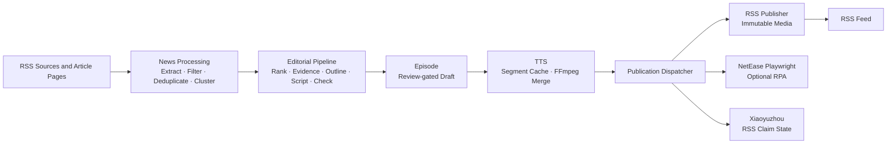

# DailyCast

An autonomous AI podcast generation platform that collects information sources, performs AI editorial workflows, generates audio, and publishes podcasts automatically.

DailyCast is a self-hosted, single-process Python application for producing a review-gated personal news podcast. It keeps task state in SQLite, media on the filesystem, and publishes approved episodes through a self-hosted RSS feed.

## Features

- RSS and web news collection: RSS discovery plus safe HTTP extraction of linked article pages
- Deterministic filtering, exact/near deduplication, and TF-IDF event clustering
- LLM editorial workflow for ranking, evidence dossiers, outlines, scripts, metadata, and review
- Structured script generation and validation before an episode can be created
- Schema-validated LLM result caching with complete semantic cache identities
- Configurable TTS generation with resumable audio-segment caching
- FFmpeg audio assembly into a checksum-verified draft MP3
- Immutable public audio assets and self-hosted RSS podcast publishing
- Independent multi-platform delivery state with failure isolation
- Optional NetEase Cloud Music creator upload through Playwright
- Docker Compose deployment with SQLite migrations and health checks

## Architecture



## Current Status

**DailyCast v0.1 Alpha**

Completed:

- [x] News ingestion
- [x] News processing
- [x] LLM editorial workflow
- [x] Script generation
- [x] TTS generation
- [x] RSS publishing
- [x] Optional NetEase Playwright publishing
- [x] Docker deployment

The Alpha example configuration records every validation/review finding while setting
`editorial.enforce_quality_gate=false` and `publishing.auto_publish=true`, so a
structurally valid local run can produce a playable RSS episode. Set the quality gate to
`true` for the strict review-required workflow; draft audio always remains private under
`DATA_DIR` until RSS publication promotes an immutable public asset.

## Quick Start

Requirements: Docker Engine or Docker Desktop with Docker Compose.

```bash
git clone https://github.com/<your-account>/dailycast.git
cd dailycast
cp .env.example .env
```

Edit `.env` for environment-specific values and review `config/app.example.yaml` and `config/sources.example.yaml`. Set `DAILYCAST_LLM__API_KEY` only in your local `.env` or deployment environment; never put it in YAML or commit it.

Start the service:

```bash
docker compose up --build
```

The container runs `alembic upgrade head` before starting the application. A failed migration stops the container.

Check service health:

```bash
curl http://127.0.0.1:8000/healthz
curl http://127.0.0.1:8000/readyz
```

The Feed URL is `http://127.0.0.1:8000/feed.xml`. It returns `404` until at least one approved episode has been successfully published. Docker Compose maps the management service to `127.0.0.1:8000` by default; publishing a Feed does not make the management API public.

`data/` is the private runtime volume for SQLite and task artifacts. `public/` contains the generated Feed and immutable media assets. Neither directory should be committed.

## Configuration

DailyCast uses two configuration layers:

- `.env` holds environment-specific values and secrets. Start with `.env.example`; its LLM API-key value is intentionally blank.
- `config/app.example.yaml` contains non-secret application, database, processing, LLM, TTS, FFmpeg, scheduler, and RSS defaults.
- `config/pronunciation.yaml` is a non-secret, versioned pronunciation dictionary used only
  while preparing provider input. It supports natural number and abbreviation speech without
  altering the reviewable stored script; changing it invalidates the affected audio cache.
- `config/sources.example.yaml` declares first-run source seeds. At startup, DailyCast creates only missing source IDs and never overwrites existing SQLite source edits; do not store credentials in source configuration.

Environment variables override YAML. `DATA_DIR` and `PUBLIC_DIR` select the runtime roots for local development; Compose also provides `DAILYCAST_DATA_DIR` and `DAILYCAST_PUBLIC_DIR` for the host-side volume paths.

`task_execution.deadline_seconds` is a durable overall deadline checked at pipeline
checkpoint boundaries. A timed-out run preserves its completed checkpoints for a later
recovery child; it does not require a broker or another worker process.

To generate the daily episode automatically, set `scheduler.enabled: true` and configure
`scheduler.cron_expression` in standard five-field cron syntax. The schedule is evaluated in
`app.timezone` (the example uses `Asia/Shanghai`); each scheduled date uses a stable idempotency
key, so repeated ticks and restarts do not create a duplicate daily TaskRun or Episode.

For a non-loopback public Feed, configure an explicit HTTPS `DAILYCAST_PUBLISHING__PUBLIC_BASE_URL` and expose only the intended Feed/media paths through your reverse proxy or static hosting setup.

### NetEase Cloud Music

NetEase delivery is opt-in and uses only the official creator website. DailyCast never
stores a username or password and never calls reverse-engineered APIs. Enable it after
an RSS publication is working:

```dotenv
DAILYCAST_PUBLISHING__RSS__ENABLED=true
DAILYCAST_PUBLISHING__NETEASE__ENABLED=true
DAILYCAST_PUBLISHING__NETEASE__PROFILE_DIR=netease/profile
DAILYCAST_PUBLISHING__NETEASE__HEADLESS=true
```

The Chromium profile is stored under `DATA_DIR/netease/profile` and must be kept on a
persistent, private volume. Establish the first login on a trusted computer:

```bash
poetry run playwright install chromium
poetry run dailycast-netease-login
```

This opens the official creator site in a headed Chromium window and waits for you to scan
or complete the normal login. It writes a portable
`DATA_DIR/netease/storage-state.json` with mode `0600`; that file is an account credential.
Transfer it to the same private path in the production persistent volume using your hosting
provider's secure file tooling. Never commit it, paste it into logs, or place it under
`PUBLIC_DIR`.

The first production run, an expired login, a captcha, or an unrecognized page puts only
the NetEase target into `needs_attention`; RSS and the generated Episode remain valid.
After renewing the official login state, resume only NetEase:

```bash
curl -X POST \
  http://127.0.0.1:8000/episodes/<episode-id>/publications/netease/resume
```

The login and resume routes are operator operations and are intentionally hidden when
`app.public_only=true`. Do not expose it without external authentication. Playwright
selectors are covered by mocked contract tests, but the platform can change its page at
any time; DailyCast stops with `NETEASE_PAGE_CHANGED` instead of guessing or bypassing
security controls.

### Zeabur

`zeabur.yaml` is a one-service deployment resource whose source is the public GitHub repository's
`main` branch. It does not upload local source code. The resource mounts `/app/data` and
`/app/public` as persistent volumes, enables the Asia/Shanghai 06:00 daily schedule, runs
Alembic before Uvicorn, and binds a Zeabur HTTPS domain to the RSS service.

During deployment, supply the public domain and LLM provider settings. The API key is a Zeabur
password variable and must never be committed. The template enables `app.public_only`, so the
public domain serves only `/healthz`, `/readyz`, `/feed.xml`, and immutable
`/media/episodes/...` assets. Management pages and `POST /generate` return `404`; production
generation is driven by the durable scheduler.

When NetEase is enabled, both `netease/profile` and `netease/storage-state.json` live below
the existing `/app/data` persistent volume. Upload the state file through a private
administrative channel before enabling the target; it is never part of the GitHub deployment.

Deploy into a selected Zeabur project with:

```bash
npx --yes zeabur@latest template deploy -f zeabur.yaml
```

## Development

Requirements: Python 3.12 and Poetry.

```bash
poetry install --with dev
poetry run alembic upgrade head
```

Run the quality suite:

```bash
poetry run ruff check .
poetry run black --check .
poetry run mypy src
poetry run pytest -q
```

The Docker startup test starts a real Compose project and is opt-in locally:

```bash
DAILYCAST_RUN_DOCKER_TEST=1 poetry run pytest -q tests/integration/test_docker_startup.py
```

## Roadmap

- [x] Alpha pipeline
- [x] Multi-platform publication dispatcher
- [x] NetEase Playwright publisher
- [ ] Web dashboard
- [ ] Zeabur one-click deployment
- [ ] Dify workflow provider
- [ ] n8n integration
- [ ] Additional API/RPA publishers
- [ ] Multi-model support

The project does not include a web dashboard, Dify, n8n, multi-user accounts, or SaaS
functionality. NetEase RPA is optional and never participates in generation.

## License

DailyCast is released under the [MIT License](LICENSE).
