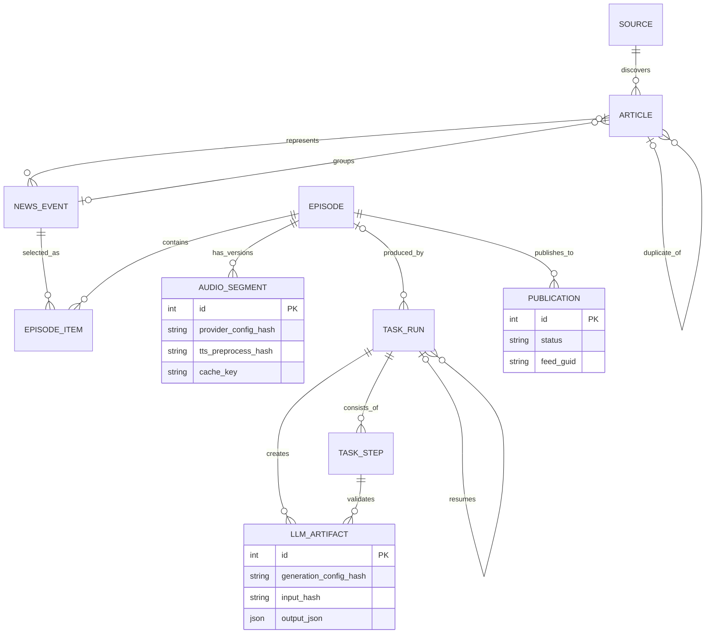

# DailyCast V1 数据模型

- 文档状态：逻辑模型与建议表结构完成；V1 由 Alembic migration 落地，本轮不创建 migration
- 日期：2026-07-22
- 数据库：SQLite 3，SQLAlchemy 2.x

## 1. 建模约定

### 1.1 通用约定

- 数据库时间统一保存 UTC，API 输出 RFC 3339；业务日期 `episode_date/event_date` 按配置时区计算并保存 `YYYY-MM-DD`。
- 数据库布尔值使用 SQLite `INTEGER 0/1`，SQLAlchemy 对外映射为 `bool`。
- JSON 使用 SQLite `TEXT` 保存，写入前由 Pydantic schema 校验，并保存 `schema_version`；DDL 建议加 `json_valid` 检查。
- 文件字段只保存相对于受控根目录的 POSIX 相对路径，不能保存用户提交的任意绝对路径。
- 金额不在 V1 范围；评分和语速等小数使用 `REAL`，Token、字节和时长毫秒使用 `INTEGER`。
- `created_at/updated_at` 由应用时钟写入，不依赖数据库本地时区。
- 已完成 TaskRun、TaskStep 和 Publication 是审计记录，不进行原地历史重写；修订通过新行、尝试号或版本字段表达。

### 1.2 ID 策略

- `Source.id` 使用配置稳定 slug，例如 `hacker-news-rss`，方便配置与日志定位。
- 大量内部实体使用 SQLite `INTEGER PRIMARY KEY`。
- `TaskRun.id` 使用 UUID 文本，便于日志关联和 API 异步轮询。
- `Episode.public_id` 使用创建时生成的 UUID 文本，作为公开 RSS GUID 和 URL 身份；不暴露可变标题或日期作为唯一身份。

### 1.3 数据库运行设置

每个连接必须启用：

```text
PRAGMA foreign_keys = ON
PRAGMA journal_mode = WAL
PRAGMA busy_timeout = 5000
```

长网络和 FFmpeg 调用期间不得持有写事务。SQLite 文件只能由一个 DailyCast 实例写入。

### 1.4 Schema revision

- V1 使用 Alembic 作为 SQLite schema 的唯一创建和升级入口；初始库通过 `alembic upgrade head` 创建。
- SQLAlchemy metadata 用于声明和生成 migration 差异，但正常应用启动不得调用 `Base.metadata.create_all()`。
- 应用启动只检查 `alembic_version` current revision 是否等于代码 head；不匹配时保持未就绪、不启动 scheduler/Task Executor，并只保留 health/readiness 诊断端点。管理页面及所有依赖业务 schema 的读取、写入、Feed/media 路由必须 fail closed。
- 下方 DDL 是初始 revision 的设计基线，不是可绕过 Alembic 直接执行的安装脚本。本轮仍不创建 migration 文件。

## 2. 实体关系



说明：

- Article 最多属于一个当前 NewsEvent；同一 NewsEvent 有多篇 Article。
- EpisodeItem 是 Episode 与 NewsEvent 的关联和发布快照，不直接把动态 Event 内容嵌入 Episode。
- 一个 Episode 可由多个生成/恢复/发布 TaskRun 操作。
- LLMArtifact 由一个 TaskRun/TaskStep 在 schema 校验成功后创建，但可被恢复任务和其他新 TaskRun 按完整缓存身份复用。
- AudioSegment 按 `script_revision` 保留版本；Episode 只指向当前有效音频版本。
- 一个 Episode 对每个发布目标最多一个逻辑 Publication，失败重试更新尝试信息而不创建重复远端节目。

## 3. Source

### 3.1 职责

描述一个可配置新闻入口。V1 `kind` 支持 `rss` 和 `html_list`。Source 是软删除/停用实体，历史 Article 始终保留来源引用。

### 3.2 字段

| 字段 | 类型 | 必填 | 约束/默认 | 说明 |
|---|---|---:|---|---|
| `id` | TEXT | 是 | PK，slug | 稳定来源标识 |
| `name` | TEXT | 是 | 非空 | 展示名称 |
| `kind` | TEXT | 是 | `rss/html_list` | 采集器类型 |
| `entry_url` | TEXT | 是 | HTTP(S) | 原始入口 URL |
| `normalized_entry_url` | TEXT | 是 | 唯一 | 规范化入口 URL |
| `enabled` | BOOLEAN | 是 | 默认 true | 是否参与定时采集 |
| `priority` | INTEGER | 是 | 默认 50，0–100 | 来源优先级，越高越优先 |
| `language` | TEXT | 否 | 如 `en/zh-CN` | 期望语言；空表示自动判断 |
| `config_json` | JSON/TEXT | 是 | 默认 `{}` | CSS 选择器、正文策略等类型配置 |
| `request_timeout_seconds` | INTEGER | 是 | 默认 20，1–120 | 单请求超时 |
| `max_items_per_run` | INTEGER | 是 | 默认 50，1–500 | 单次发现上限 |
| `last_success_at` | DATETIME | 否 |  | 最近成功采集时间 |
| `last_error_code` | TEXT | 否 |  | 最近错误分类 |
| `last_error_summary` | TEXT | 否 | 最长 1,000 字符 | 脱敏摘要 |
| `created_at` | DATETIME | 是 |  | 创建时间 |
| `updated_at` | DATETIME | 是 |  | 修改时间 |

### 3.3 约束、索引与生命周期

- 唯一：`id`、`normalized_entry_url`。
- 索引：`(enabled, priority DESC)`、`kind`。
- 创建后可修改显示、优先级和采集配置；修改入口 URL 视为同一配置实体的新版本并改变配置 fingerprint。
- “删除”默认设置 `enabled=false`；被 Article 引用时禁止物理删除。
- 关系：一对多 Article。

## 4. Article

### 4.1 职责

保存发现的文章、正文提取结果、确定性过滤/去重结论和事件归属。失败文章也保留，以防每次任务重复请求同一坏链接。

### 4.2 字段

| 字段 | 类型 | 必填 | 约束/默认 | 说明 |
|---|---|---:|---|---|
| `id` | INTEGER | 是 | PK autoincrement | 内部 ID |
| `source_id` | TEXT | 是 | FK Source，RESTRICT | 首次/主发现来源 |
| `external_id` | TEXT | 否 | source 内可唯一 | RSS GUID 等 |
| `url` | TEXT | 是 |  | 首次发现 URL |
| `normalized_url` | TEXT | 是 |  | 规范 URL |
| `url_hash` | TEXT(64) | 是 | 唯一 | SHA-256 hex |
| `title` | TEXT | 是 | 非空 | 原标题 |
| `normalized_title` | TEXT | 是 |  | 判重标题 |
| `title_hash` | TEXT(64) | 是 |  | 标题 SHA-256 |
| `summary` | TEXT | 否 |  | RSS/提取摘要 |
| `content_text` | TEXT | 否 |  | 清洗纯正文，不含 HTML |
| `content_hash` | TEXT(64) | 否 |  | 规范正文 SHA-256 |
| `simhash` | TEXT(16) | 否 | hex | 64-bit SimHash，文本存储避免有符号溢出 |
| `language` | TEXT | 否 |  | 检测/来源语言 |
| `published_at` | DATETIME | 否 |  | 来源发布时间 |
| `published_at_inferred` | BOOLEAN | 是 | 默认 false | 是否由发现时间推断 |
| `discovered_at` | DATETIME | 是 |  | 首次发现时间 |
| `fetched_at` | DATETIME | 否 |  | 最近 HTTP 成功时间 |
| `extracted_at` | DATETIME | 否 |  | 最近正文提取时间 |
| `content_updated_at` | DATETIME | 否 |  | 正文变化时间 |
| `http_status` | INTEGER | 否 |  | 最近 HTTP 状态 |
| `status` | TEXT | 是 | 状态枚举 | 见下方 |
| `filter_reason` | TEXT | 否 | 稳定代码 | 过旧、过短、语言等 |
| `duplicate_of_article_id` | INTEGER | 否 | self FK，SET NULL | 主文章 |
| `news_event_id` | INTEGER | 否 | FK NewsEvent，SET NULL | 当前事件归属 |
| `error_code` | TEXT | 否 |  | 最近提取错误 |
| `error_summary` | TEXT | 否 | 最长 1,000 字符 | 脱敏摘要 |
| `metadata_json` | JSON/TEXT | 是 | 默认 `{}` | 作者、canonical 候选、发现信息等 |
| `created_at` | DATETIME | 是 |  |  |
| `updated_at` | DATETIME | 是 |  |  |

`status`：`discovered`、`fetching`、`extracted`、`eligible`、`filtered`、`duplicate`、`extraction_failed`。

### 4.3 约束、索引与生命周期

- 唯一：`url_hash`；`(source_id, external_id)` 在 external_id 非空时唯一。
- 索引：`source_id`、`published_at DESC`、`status`、`title_hash`、`content_hash`、`news_event_id`、`duplicate_of_article_id`。
- 同一 URL 重复发现执行 upsert 并保留最早 `discovered_at`；正文发生真实变化可更新内容字段和哈希，但须使相关未发布下游 fingerprint 失效。对同一 `(source_id, external_id)`，若新候选的规范 URL 与已持久化 URL 不同，拒绝该候选并记录稳定错误码 `RSS_EXTERNAL_ID_URL_CONFLICT`，不覆盖旧 Article，也不依赖数据库唯一冲突作为控制流。
- 用于已发布 EpisodeItem 的 Article 不自动删除。超出保留期的失败/过滤 Article 可按配置清理，但先检查事件和节目引用。
- 关系：属于一个 Source；可指向一个主 Article；可属于一个 NewsEvent；可作为 NewsEvent 代表文章。

## 5. NewsEvent

### 5.1 职责

表示时间窗内多篇报道共同描述的新闻事件，并保存聚类版本、确定性特征、LLM 分数和入选理由。

### 5.2 字段

| 字段 | 类型 | 必填 | 约束/默认 | 说明 |
|---|---|---:|---|---|
| `id` | INTEGER | 是 | PK autoincrement |  |
| `event_key` | TEXT | 是 | 唯一 | `{event_date}:{seed_article_id}` |
| `event_date` | DATE/TEXT | 是 |  | 配置时区业务日期 |
| `representative_article_id` | INTEGER | 是 | FK Article，RESTRICT | 代表文章 |
| `title` | TEXT | 是 |  | 确定性代表标题或经审计标题 |
| `summary` | TEXT | 否 |  | 限长事件摘要 |
| `status` | TEXT | 是 | `candidate/scored/selected/rejected` | 当前编辑状态 |
| `first_published_at` | DATETIME | 否 |  | 成员最早时间 |
| `last_published_at` | DATETIME | 否 |  | 成员最晚时间 |
| `article_count` | INTEGER | 是 | 默认 1 | 非重复成员数 |
| `source_count` | INTEGER | 是 | 默认 1 | 不同来源数 |
| `deterministic_score` | REAL | 是 | 默认 0 | 预排序分数 |
| `importance_score` | REAL | 否 | 0–100 | LLM 重要性 |
| `relevance_score` | REAL | 否 | 0–100 | LLM 相关性 |
| `confidence_score` | REAL | 否 | 0–100 | LLM 证据置信度 |
| `selection_reason` | TEXT | 否 |  | 入选/不入选理由 |
| `risk_flags_json` | JSON/TEXT | 是 | 默认 `[]` | 争议、证据不足等 |
| `score_json` | JSON/TEXT | 否 |  | 完整已校验评分输出 |
| `cluster_algorithm` | TEXT | 是 | `tfidf_char` | 算法名称 |
| `cluster_version` | TEXT | 是 | 例如 `1` | 算法/规则版本 |
| `cluster_threshold` | REAL | 是 | 默认 0.58 | 本次阈值 |
| `cluster_signature` | TEXT(64) | 是 |  | 排序成员 hash 的 SHA-256 |
| `llm_model` | TEXT | 否 |  | 评分模型 |
| `llm_prompt_version` | TEXT | 否 |  | 评分提示词版本 |
| `created_at` | DATETIME | 是 |  |  |
| `updated_at` | DATETIME | 是 |  |  |

### 5.3 约束、索引与生命周期

- 唯一：`event_key`。
- 索引：`event_date DESC`、`status`、`importance_score DESC`、`cluster_signature`、`representative_article_id`。
- 候选期间可增加成员和重算摘要/分数；一旦被 EpisodeItem 引用，EpisodeItem 中的理由、分数、标题和来源列表是当时快照。
- 未被节目引用的旧候选可按保留策略清理；已引用 Event 保留。
- 关系：一对多 Article；由一篇 Article 代表；一对多 EpisodeItem。

## 6. Episode

### 6.1 职责

表示某业务日期和 edition 的一期节目，保存生成内容、人工修订、检查、当前草稿音频和发布状态。

### 6.2 字段

| 字段 | 类型 | 必填 | 约束/默认 | 说明 |
|---|---|---:|---|---|
| `id` | INTEGER | 是 | PK autoincrement |  |
| `public_id` | TEXT(36) | 是 | 唯一 UUID | RSS GUID/公开身份 |
| `episode_date` | DATE/TEXT | 是 |  | 业务日期 |
| `edition` | TEXT | 是 | 默认 `daily` | 同日版本名 |
| `status` | TEXT | 是 | 状态枚举 | draft 等 |
| `lock_version` | INTEGER | 是 | 默认 1 | 乐观并发控制 |
| `title` | TEXT | 否 |  | 待生成时可空 |
| `description` | TEXT | 否 |  | 节目简介 |
| `outline_json` | JSON/TEXT | 否 |  | 已校验大纲 |
| `script_json` | JSON/TEXT | 否 |  | 结构化稿件及引用 |
| `script_text` | TEXT | 否 |  | 供编辑/TTS 的纯文本投影 |
| `script_revision` | INTEGER | 是 | 默认 0 | 每次稿件变更 +1 |
| `script_hash` | TEXT(64) | 否 |  | 当前规范稿 SHA-256 |
| `script_origin` | TEXT | 否 | `generated/edited` | 当前稿来源 |
| `review_json` | JSON/TEXT | 否 |  | 代码和 LLM 检查结果 |
| `target_duration_seconds` | INTEGER | 否 |  | 大纲目标时长 |
| `actual_duration_ms` | INTEGER | 否 |  | 当前草稿时长 |
| `audio_version` | INTEGER | 是 | 默认 0 | 每次有效合并 +1 |
| `audio_manifest_hash` | TEXT(64) | 否 |  | 有序片段清单 hash |
| `draft_audio_path` | TEXT | 否 | 相对 `DATA_DIR/audio/drafts/` | 当前草稿 MP3，绝不位于 `PUBLIC_DIR` |
| `draft_audio_sha256` | TEXT(64) | 否 |  |  |
| `approved_script_revision` | INTEGER | 否 |  | 批准绑定版本 |
| `approved_audio_version` | INTEGER | 否 |  | 批准绑定版本 |
| `approved_at` | DATETIME | 否 |  |  |
| `published_at` | DATETIME | 否 |  | 首次成功发布时间 |
| `error_code` | TEXT | 否 |  | 终止错误 |
| `error_summary` | TEXT | 否 | 最长 1,000 字符 |  |
| `created_at` | DATETIME | 是 |  |  |
| `updated_at` | DATETIME | 是 |  |  |

`status`：`draft`、`review_required`、`approved`、`publishing`、`published`、`failed`。

### 6.3 约束、索引与生命周期

- 唯一：`public_id`、`(episode_date, edition)`。
- 索引：`status`、`episode_date DESC`、`published_at DESC`。
- 新建为 draft；只有当前稿件修订、检查结果和草稿音频全部有效时才能进入 review_required；人工批准绑定修订；发布成功后 published。普通同日 retry 复用同一 Episode；只有显式 `regenerate_episode` TaskRun 才能替换未发布 Episode 的编辑内容、增加 `script_revision` 并清除音频/批准绑定。published/publishing Episode 不能原地 regenerate。
- 标题/简介在发布前修正时增加 `lock_version`；若原为 approved，则清空批准绑定并进入 review_required，但不使检查和音频失效。人工修改稿件必须增加 `script_revision`，清空 `approved_script_revision`、`approved_audio_version`、`approved_at` 和 `review_json`，清除 `audio_manifest_hash`、`draft_audio_path`、`draft_audio_sha256` 与当前时长引用，并进入 draft；旧文件按保留策略留作历史，不再视为当前音频。
- 从 approved 仅撤销批准且稿件、检查和音频仍有效时，清空批准字段并进入 review_required。修改稿件、音色、语速、TTS model 或当前有效音频片段时必须使相应产物失效并进入 draft；完成重新检查和最终音频合并后才回到 review_required。
- published Episode 默认永久保留且 V1 不允许编辑；修正通过新 edition 表达，公开音频不随数据库字段更新而覆盖。
- 关系：一对多 EpisodeItem、AudioSegment、TaskRun、Publication。

## 7. EpisodeItem

### 7.1 职责

连接节目与入选事件，保存当时的顺序和编辑快照，使后续 Event 更新不会改变已审/已发布内容的解释。

### 7.2 字段

| 字段 | 类型 | 必填 | 约束/默认 | 说明 |
|---|---|---:|---|---|
| `id` | INTEGER | 是 | PK autoincrement |  |
| `episode_id` | INTEGER | 是 | FK Episode，CASCADE |  |
| `news_event_id` | INTEGER | 是 | FK NewsEvent，RESTRICT |  |
| `position` | INTEGER | 是 | 从 1 开始 | 节目顺序 |
| `event_title_snapshot` | TEXT | 是 |  | 入选时标题 |
| `selection_reason_snapshot` | TEXT | 是 |  | 入选理由 |
| `score_snapshot_json` | JSON/TEXT | 是 |  | 各维度分数 |
| `source_article_ids_json` | JSON/TEXT | 是 | 非空数组 | 当时采用的证据文章 IDs |
| `section_id` | TEXT | 否 |  | 大纲/稿件 section 关联 |
| `created_at` | DATETIME | 是 |  |  |
| `updated_at` | DATETIME | 是 |  |  |

### 7.3 约束、索引与生命周期

- 唯一：`(episode_id, news_event_id)`、`(episode_id, position)`。
- 索引：`news_event_id`、`episode_id`。
- Episode 仍为 draft 时可重新排序/替换；进入 approved 后冻结，任何重选都会使稿件及下游失效并让 Episode 回到 draft，完成全部下游后才进入 review_required。
- Episode 删除时级联删除；已 published Episode 不允许普通删除。
- 关系：属于 Episode 和 NewsEvent。

## 8. TaskRun

### 8.1 职责

记录一次流水线命令的整体状态、业务幂等、配置快照、资源用量、父子恢复关系和任务日志位置。

### 8.2 字段

| 字段 | 类型 | 必填 | 约束/默认 | 说明 |
|---|---|---:|---|---|
| `id` | TEXT(36) | 是 | PK UUID | 日志 correlation ID |
| `task_type` | TEXT | 是 | 枚举 | `daily_generate/publish/regenerate_episode/regenerate_segment` |
| `business_key` | TEXT | 是 | 活动时唯一 | 逻辑任务身份 |
| `idempotency_key` | TEXT | 是 | 唯一 | API/调度请求键 |
| `trigger_type` | TEXT | 是 | `manual/scheduled/retry` | 触发来源 |
| `status` | TEXT | 是 | 状态枚举 | 见下方 |
| `current_step` | TEXT | 否 |  | 当前/最后步骤 |
| `episode_id` | INTEGER | 否 | FK Episode，SET NULL | 关联节目 |
| `parent_task_run_id` | TEXT | 否 | self FK，SET NULL | 续跑来源 |
| `pipeline_version` | TEXT | 是 |  | 步骤/规则版本 |
| `config_fingerprint` | TEXT(64) | 是 |  | 脱敏配置 hash |
| `config_snapshot_json` | JSON/TEXT | 是 |  | 脱敏可重放配置 |
| `request_json` | JSON/TEXT | 是 |  | 日期、edition、重生成范围等 |
| `started_at` | DATETIME | 否 |  |  |
| `ended_at` | DATETIME | 否 |  |  |
| `deadline_at` | DATETIME | 否 |  | 总超时截止 |
| `heartbeat_at` | DATETIME | 否 | running 时每 15 秒更新 | 60 秒未更新视为 stale |
| `warning_count` | INTEGER | 是 | 默认 0 |  |
| `llm_call_count` | INTEGER | 是 | 默认 0 | 含 schema repair |
| `llm_input_tokens` | INTEGER | 是 | 默认 0 |  |
| `llm_output_tokens` | INTEGER | 是 | 默认 0 |  |
| `tts_character_count` | INTEGER | 是 | 默认 0 | 实际请求字符 |
| `retryable` | BOOLEAN | 是 | 默认 false | 终态是否可续跑 |
| `error_code` | TEXT | 否 |  |  |
| `error_summary` | TEXT | 否 | 最长 1,000 字符 |  |
| `log_path` | TEXT | 否 | 相对 data 目录 | 任务 JSONL |
| `created_at` | DATETIME | 是 |  |  |
| `updated_at` | DATETIME | 是 |  |  |

`status`：`queued`、`running`、`waiting_action`、`succeeded`、`succeeded_with_warnings`、`failed`、`timed_out`、`interrupted`、`cancelled`。

### 8.3 约束、索引与生命周期

- 唯一：`id`、`idempotency_key`；部分唯一 `(business_key) WHERE status IN ('queued','running')`。
- 索引：`created_at DESC`、`status`、`task_type`、`episode_id`、`parent_task_run_id`、`heartbeat_at`。
- `waiting_action` 是保留 artifact 的非失败终态；其他终态记录不可重新置为 running。续跑创建新 TaskRun 并关联 parent。
- 启动恢复先重新入队 queued；将心跳超过 60 秒未更新的 running 行置为 interrupted，并以旧 TaskRun ID 派生幂等键创建至多一个 queued 子恢复任务。
- 审计摘要长期保留；详细 JSONL 可按保留期清理。
- 关系：可属于 Episode；一对多 TaskStep 和首次创建的 LLMArtifact；可形成父子续跑链。

## 9. TaskStep

### 9.1 职责

保存 TaskRun 中一个逻辑步骤的一次尝试、计数、错误、输入输出 fingerprint 和恢复检查点。

### 9.2 字段

| 字段 | 类型 | 必填 | 约束/默认 | 说明 |
|---|---|---:|---|---|
| `id` | INTEGER | 是 | PK autoincrement |  |
| `task_run_id` | TEXT | 是 | FK TaskRun，CASCADE |  |
| `step_name` | TEXT | 是 | 稳定枚举 | collecting 等 |
| `step_order` | INTEGER | 是 |  | 流程顺序 |
| `attempt` | INTEGER | 是 | 从 1 开始 | 步骤尝试号 |
| `status` | TEXT | 是 | 状态枚举 | pending 等 |
| `started_at` | DATETIME | 否 |  |  |
| `ended_at` | DATETIME | 否 |  |  |
| `input_count` | INTEGER | 否 |  |  |
| `output_count` | INTEGER | 否 |  |  |
| `warning_count` | INTEGER | 是 | 默认 0 |  |
| `input_fingerprint` | TEXT(64) | 否 |  | 判断检查点可复用 |
| `output_fingerprint` | TEXT(64) | 否 |  | 产物清单 hash |
| `checkpoint_json` | JSON/TEXT | 否 |  | 已完成对象 IDs/产物引用 |
| `details_json` | JSON/TEXT | 是 | 默认 `{}` | 聚合统计，不放密钥/全文 |
| `artifact_path` | TEXT | 否 | 受控相对路径 | 可选结构化结果 |
| `llm_call_count` | INTEGER | 是 | 默认 0 |  |
| `llm_input_tokens` | INTEGER | 是 | 默认 0 |  |
| `llm_output_tokens` | INTEGER | 是 | 默认 0 |  |
| `tts_character_count` | INTEGER | 是 | 默认 0，非负 CHECK | 实际 Provider 请求字符数 |
| `retryable` | BOOLEAN | 是 | 默认 false |  |
| `error_code` | TEXT | 否 |  |  |
| `error_summary` | TEXT | 否 | 最长 1,000 字符 |  |
| `created_at` | DATETIME | 是 |  |  |
| `updated_at` | DATETIME | 是 |  |  |

`status`：`pending`、`running`、`succeeded`、`succeeded_with_warnings`、`failed`、`skipped`。

### 9.3 约束、索引与生命周期

- 唯一：`(task_run_id, step_name, attempt)`。
- 索引：`(task_run_id, step_order)`、`status`、`error_code`。
- 一次尝试结束后不覆盖结果；同 TaskRun 自动重试增加 attempt。跨 TaskRun 续跑引用父步骤 fingerprint，但创建新行。
- TaskRun 删除时级联；正常运维不删除 TaskRun。
- 关系：属于一个 TaskRun；可创建多个不同操作/输入身份的 LLMArtifact。

## 10. LLMArtifact

### 10.1 职责

持久化已经通过本地 schema 校验的 LLM 结构化成功结果，为当前 TaskRun 恢复和后续新 TaskRun 提供精确、跨运行复用。LLMArtifact 不是模型调用日志，也不保存失败响应或原始 Prompt。

### 10.2 字段

| 字段 | 类型 | 必填 | 约束/默认 | 说明 |
|---|---|---:|---|---|
| `id` | INTEGER | 是 | PK autoincrement | Artifact ID |
| `operation` | TEXT | 是 | 非空 | `score_events/generate_outline/generate_script/generate_metadata/review_script` |
| `provider` | TEXT | 是 | 非空 | Provider 稳定名称，如 `openai_compatible` |
| `model` | TEXT | 是 | 非空 | 实际配置模型名 |
| `prompt_version` | TEXT | 是 | 非空 | 版本化 Prompt 身份 |
| `schema_version` | TEXT | 是 | 非空 | 输出 schema 版本 |
| `generation_config_hash` | TEXT(64) | 是 | SHA-256 | 非敏感、影响输出语义的 generation config canonical hash |
| `input_hash` | TEXT(64) | 是 | SHA-256 | 限长规范输入 canonical JSON 的 hash |
| `output_json` | JSON/TEXT | 是 | `json_valid` | 通过对应 schema 校验的结构化输出 |
| `output_hash` | TEXT(64) | 是 | SHA-256 | canonical output JSON 的 hash |
| `input_tokens` | INTEGER | 是 | 默认 0，非负 | Provider 报告/估算输入 Token |
| `output_tokens` | INTEGER | 是 | 默认 0，非负 | Provider 报告/估算输出 Token |
| `provider_request_id` | TEXT | 否 |  | 供应商请求关联 ID，不含凭证 |
| `created_by_task_run_id` | TEXT | 是 | FK TaskRun，RESTRICT | 首次成功创建任务 |
| `created_by_task_step_id` | INTEGER | 是 | FK TaskStep，RESTRICT | 完成校验并创建的步骤 |
| `created_at` | DATETIME | 是 |  | 创建时间；Artifact 创建后不可修改 |

### 10.3 约束、索引与生命周期

- 唯一：`(operation, provider, model, prompt_version, schema_version, generation_config_hash, input_hash)`；这七个字段共同构成完整缓存身份。
- 索引：`created_at`、`created_by_task_run_id`、`created_by_task_step_id`、`output_hash`。
- `generation_config_hash` 是按键排序并统一数值/空值表达的 canonical JSON SHA-256，至少覆盖 `endpoint_identity_hash`、temperature、可选 top_p、max_output_tokens、response format/structured output mode 和其他影响结果的 provider model options。endpoint 只以规范化、脱敏后的身份 hash 参与并落库；明文 URL 中的 userinfo、token、signature 或其他疑似凭证必须拒绝/移除。API Key、Authorization、timeout、连接参数和 retry 次数不参与缓存身份，也不保存。
- `output_json` 必须先由 `schema_version` 对应的本地 schema 校验，再与 `output_hash` 一起在短事务中插入；仅通过校验的成功结果有记录。
- TaskRun 恢复和新 TaskRun 都通过 LLMArtifactRepository 查询完整七字段唯一键。provider、model、Prompt、schema、generation config 或输入任一变化都会 cache miss；只有成功且 exact-key 相同的行可复用。
- 不保存系统密钥、Authorization、Cookie、未经限制的完整原始 Prompt或所有新闻全文。失败、超时、拒绝和 schema 不合法的供应商响应只进入脱敏 TaskStep 错误/日志，不写此表。
- Artifact 创建后不可更新；并发插入唯一冲突时读取已有成功行。V1 不提供编辑或删除单条 Artifact 的 API。
- 默认保留 180 天。业务结果已经快照到 NewsEvent/Episode；到期清理只影响未来缓存命中率。进程内 scheduler 每天 03:30 在无活动重型 TaskRun 时按 `created_at` 每批最多删除 500 行；保留期清理不得删除 TaskRun/TaskStep，且不以修改 Artifact 代替重新调用。
- 关系：由一个 TaskRun 和其中一个 TaskStep 创建；可被任意后续 TaskRun 只读复用。

## 11. AudioSegment

### 11.1 职责

表示某一期某次稿件修订的一个有序 TTS 片段及其内容缓存身份、供应商配置、文件校验和错误。

### 11.2 字段

| 字段 | 类型 | 必填 | 约束/默认 | 说明 |
|---|---|---:|---|---|
| `id` | INTEGER | 是 | PK autoincrement |  |
| `episode_id` | INTEGER | 是 | FK Episode，CASCADE |  |
| `script_revision` | INTEGER | 是 |  | 所属稿件版本 |
| `segment_index` | INTEGER | 是 | 从 0 开始 | 播放顺序 |
| `segmenter_version` | TEXT | 是 |  | 分段算法版本 |
| `text` | TEXT | 是 | 非空 | 片段口播文本 |
| `text_hash` | TEXT(64) | 是 |  | 规范文本 SHA-256 |
| `cache_key` | TEXT(64) | 是 | 索引 | 完整 TTS 语义配置 + 规范文本 hash |
| `force_nonce` | TEXT | 否 |  | 手动强制再生时区分缓存 |
| `provider` | TEXT | 是 |  | Provider 名称 |
| `model` | TEXT | 是 |  |  |
| `voice` | TEXT | 是 |  |  |
| `speed` | REAL | 是 | 默认 1.0 |  |
| `format` | TEXT | 是 | 默认 `mp3` |  |
| `provider_config_hash` | TEXT(64) | 是 | SHA-256 | Provider 实现/endpoint/额外音频语义选项的非秘密 canonical hash |
| `tts_preprocess_hash` | TEXT(64) | 是 | SHA-256 | 发音词典、金融数字规则、增强断句模式及其他影响口播输入的非秘密 canonical hash |
| `status` | TEXT | 是 | 状态枚举 | 见下方 |
| `audio_path` | TEXT | 否 | 相对私有目录 | 校验后文件 |
| `mime_type` | TEXT | 否 |  | 如 `audio/mpeg` |
| `byte_size` | INTEGER | 否 |  |  |
| `sha256` | TEXT(64) | 否 |  | 文件 checksum |
| `duration_ms` | INTEGER | 否 |  | ffprobe 结果 |
| `attempt_count` | INTEGER | 是 | 默认 0 |  |
| `provider_request_id` | TEXT | 否 |  | 调试关联，不含秘密 |
| `error_code` | TEXT | 否 |  |  |
| `error_summary` | TEXT | 否 | 最长 1,000 字符 |  |
| `created_at` | DATETIME | 是 |  |  |
| `updated_at` | DATETIME | 是 |  |  |

`status`：`pending`、`synthesizing`、`succeeded`、`failed`、`stale`。

### 11.3 约束、索引与生命周期

- 唯一：`(episode_id, script_revision, segment_index)`。
- 索引：`(cache_key, provider_config_hash, tts_preprocess_hash, status)`、`(episode_id, script_revision, status)`、`sha256`。
- `provider_config_hash = SHA-256(canonical JSON({provider_implementation_identity, endpoint_identity_hash, semantic_provider_options_sorted}))`。endpoint 只保存规范化、脱敏后的身份 hash；API Key、Authorization、timeout 和 retry 次数不参与。model、voice、speed、format 在 cache_key 中显式出现，不放入该 hash 的唯一规范，避免双重定义。
- `cache_key = SHA-256(provider + provider_config_hash + model + voice + canonical_speed + format + segmenter_version + tts_preprocess_hash + normalized_text)`。base_url/Provider 实现、额外音频语义参数、voice、speed、model、format、开场/结尾有效语速、发音词典或预处理规则任一变化都 cache miss；密钥、timeout/retry 变化不会使缓存失效。
- 新修订创建新行；仅可按完整 `cache_key + provider_config_hash + tts_preprocess_hash` 查找历史 `succeeded` 行，并在 checksum/解码校验后复用文件。AudioCache 不得使用缺少 Provider 或预处理语义的旧 cache_key。
- 稿件/TTS 配置变化后旧行保留为历史；当前修订不再引用时可标 stale。
- 重生成当前有效片段或修改 voice/speed/TTS model 时，Episode 清空批准绑定和当前草稿音频引用并进入 draft；只有所有当前片段校验和最终合并成功后才进入 review_required。
- 清理缓存前必须确认没有任一非 stale AudioSegment 引用相同 checksum/path。
- 关系：属于一个 Episode。

## 12. Publication

### 12.1 职责

记录某 Episode 向 V1 RSS 目标的幂等发布状态、公开资产和验证信息。未来外部平台字段和人工处理状态通过对应阶段的 Alembic revision 增加。

### 12.2 字段

| 字段 | 类型 | 必填 | 约束/默认 | 说明 |
|---|---|---:|---|---|
| `id` | INTEGER | 是 | PK autoincrement |  |
| `episode_id` | INTEGER | 是 | FK Episode，RESTRICT |  |
| `publisher_type` | TEXT | 是 | V1 仅 `rss` | 目标实现；未来类型需 migration |
| `target_key` | TEXT | 是 |  | 目标配置 slug |
| `status` | TEXT | 是 | 状态枚举 | 见下方 |
| `idempotency_key` | TEXT | 是 | 唯一 | 目标发布键 |
| `attempt_count` | INTEGER | 是 | 默认 0 |  |
| `request_fingerprint` | TEXT(64) | 是 |  | 元数据 + 资产 hash |
| `remote_id` | TEXT | 否 |  | 平台节目 ID |
| `remote_url` | TEXT | 否 |  | 平台页面/Feed URL |
| `public_asset_path` | TEXT | 否 | 相对 public 目录 | RSS 公开 MP3 |
| `public_audio_url` | TEXT | 否 | 绝对 URL | enclosure URL |
| `asset_sha256` | TEXT(64) | 否 |  | 公开文件校验 |
| `asset_byte_size` | INTEGER | 否 |  |  |
| `feed_guid` | TEXT | 否 |  | RSS 使用 Episode public_id |
| `response_summary_json` | JSON/TEXT | 否 | 脱敏 | 上游摘要/本地验证 |
| `last_verified_at` | DATETIME | 否 |  |  |
| `published_at` | DATETIME | 否 |  |  |
| `error_code` | TEXT | 否 |  |  |
| `error_summary` | TEXT | 否 | 最长 1,000 字符 |  |
| `created_at` | DATETIME | 是 |  |  |
| `updated_at` | DATETIME | 是 |  |  |

V1 `status`：`pending`、`publishing`、`published`、`failed`。未来实现 RPA 时再通过 migration 增加 `needs_attention` 和 `human_action_code`。

### 12.3 约束、索引与生命周期

- 唯一：`(episode_id, publisher_type, target_key)`、`idempotency_key`。
- 索引：`status`、`publisher_type`、`remote_id`、`published_at DESC`。
- 重试先 reconcile 当前行和目标状态，再增加 attempt；不能通过新增行规避不确定发布结果。发布顺序固定为：创建/复用 `publishing` 行，提升并校验不可变 MP3，读取既有 published 行，把当前 publishing 行作为已验证 candidate 显式注入内存 Feed，校验并原子替换 Feed，最后短事务标记 Publication/Episode=`published`。
- 若 Feed 已包含该 `feed_guid` 且 enclosure、MIME、长度和公开文件 checksum 正确，而数据库仍为 `publishing`，reconcile 补写两个 published 状态；按 GUID upsert，不重复 item，不重复复制或覆盖已存在的不可变音频。稳定状态 Feed 只包含成功 published 节目。
- RSS published 后公开资产默认永久保留。V1 不创建 Podbean 或网易云 Publication。
- 关系：属于一个 Episode。

## 13. 建议 SQLite 表结构

以下 DDL 只表达初始 Alembic revision 应实现的结构、约束和索引，**本阶段不执行，也不创建 migration 文件**。项目骨架阶段由 SQLAlchemy metadata 与 `migrations/versions/0001_initial_schema.py` 落地，并对实际 SQLite 版本做 migration 集成测试。

```sql
CREATE TABLE sources (
  id TEXT PRIMARY KEY,
  name TEXT NOT NULL,
  kind TEXT NOT NULL CHECK (kind IN ('rss', 'html_list')),
  entry_url TEXT NOT NULL,
  normalized_entry_url TEXT NOT NULL UNIQUE,
  enabled INTEGER NOT NULL DEFAULT 1 CHECK (enabled IN (0, 1)),
  priority INTEGER NOT NULL DEFAULT 50 CHECK (priority BETWEEN 0 AND 100),
  language TEXT,
  config_json TEXT NOT NULL DEFAULT '{}' CHECK (json_valid(config_json)),
  request_timeout_seconds INTEGER NOT NULL DEFAULT 20 CHECK (request_timeout_seconds BETWEEN 1 AND 120),
  max_items_per_run INTEGER NOT NULL DEFAULT 50 CHECK (max_items_per_run BETWEEN 1 AND 500),
  last_success_at DATETIME,
  last_error_code TEXT,
  last_error_summary TEXT,
  created_at DATETIME NOT NULL,
  updated_at DATETIME NOT NULL
);
CREATE INDEX ix_sources_enabled_priority ON sources(enabled, priority DESC);
CREATE INDEX ix_sources_kind ON sources(kind);

CREATE TABLE articles (
  id INTEGER PRIMARY KEY AUTOINCREMENT,
  source_id TEXT NOT NULL REFERENCES sources(id) ON DELETE RESTRICT,
  external_id TEXT,
  url TEXT NOT NULL,
  normalized_url TEXT NOT NULL,
  url_hash TEXT NOT NULL UNIQUE,
  title TEXT NOT NULL,
  normalized_title TEXT NOT NULL,
  title_hash TEXT NOT NULL,
  summary TEXT,
  content_text TEXT,
  content_hash TEXT,
  simhash TEXT,
  language TEXT,
  published_at DATETIME,
  published_at_inferred INTEGER NOT NULL DEFAULT 0 CHECK (published_at_inferred IN (0, 1)),
  discovered_at DATETIME NOT NULL,
  fetched_at DATETIME,
  extracted_at DATETIME,
  content_updated_at DATETIME,
  http_status INTEGER,
  status TEXT NOT NULL CHECK (status IN ('discovered','fetching','extracted','eligible','filtered','duplicate','extraction_failed')),
  filter_reason TEXT,
  duplicate_of_article_id INTEGER REFERENCES articles(id) ON DELETE SET NULL,
  news_event_id INTEGER REFERENCES news_events(id) ON DELETE SET NULL,
  error_code TEXT,
  error_summary TEXT,
  metadata_json TEXT NOT NULL DEFAULT '{}' CHECK (json_valid(metadata_json)),
  created_at DATETIME NOT NULL,
  updated_at DATETIME NOT NULL
);
CREATE UNIQUE INDEX uq_articles_source_external ON articles(source_id, external_id) WHERE external_id IS NOT NULL;
CREATE INDEX ix_articles_source ON articles(source_id);
CREATE INDEX ix_articles_published ON articles(published_at DESC);
CREATE INDEX ix_articles_status ON articles(status);
CREATE INDEX ix_articles_title_hash ON articles(title_hash);
CREATE INDEX ix_articles_content_hash ON articles(content_hash);
CREATE INDEX ix_articles_event ON articles(news_event_id);
CREATE INDEX ix_articles_duplicate ON articles(duplicate_of_article_id);

CREATE TABLE news_events (
  id INTEGER PRIMARY KEY AUTOINCREMENT,
  event_key TEXT NOT NULL UNIQUE,
  event_date DATE NOT NULL,
  representative_article_id INTEGER NOT NULL REFERENCES articles(id) ON DELETE RESTRICT,
  title TEXT NOT NULL,
  summary TEXT,
  status TEXT NOT NULL CHECK (status IN ('candidate','scored','selected','rejected')),
  first_published_at DATETIME,
  last_published_at DATETIME,
  article_count INTEGER NOT NULL DEFAULT 1 CHECK (article_count >= 1),
  source_count INTEGER NOT NULL DEFAULT 1 CHECK (source_count >= 1),
  deterministic_score REAL NOT NULL DEFAULT 0,
  importance_score REAL,
  relevance_score REAL,
  confidence_score REAL,
  selection_reason TEXT,
  risk_flags_json TEXT NOT NULL DEFAULT '[]' CHECK (json_valid(risk_flags_json)),
  score_json TEXT CHECK (score_json IS NULL OR json_valid(score_json)),
  cluster_algorithm TEXT NOT NULL,
  cluster_version TEXT NOT NULL,
  cluster_threshold REAL NOT NULL,
  cluster_signature TEXT NOT NULL,
  llm_model TEXT,
  llm_prompt_version TEXT,
  created_at DATETIME NOT NULL,
  updated_at DATETIME NOT NULL,
  CHECK (importance_score IS NULL OR importance_score BETWEEN 0 AND 100),
  CHECK (relevance_score IS NULL OR relevance_score BETWEEN 0 AND 100),
  CHECK (confidence_score IS NULL OR confidence_score BETWEEN 0 AND 100)
);
CREATE INDEX ix_news_events_date ON news_events(event_date DESC);
CREATE INDEX ix_news_events_status ON news_events(status);
CREATE INDEX ix_news_events_importance ON news_events(importance_score DESC);
CREATE INDEX ix_news_events_signature ON news_events(cluster_signature);
CREATE INDEX ix_news_events_representative ON news_events(representative_article_id);

CREATE TABLE episodes (
  id INTEGER PRIMARY KEY AUTOINCREMENT,
  public_id TEXT NOT NULL UNIQUE,
  episode_date DATE NOT NULL,
  edition TEXT NOT NULL DEFAULT 'daily',
  status TEXT NOT NULL CHECK (status IN ('draft','review_required','approved','publishing','published','failed')),
  lock_version INTEGER NOT NULL DEFAULT 1,
  title TEXT,
  description TEXT,
  outline_json TEXT CHECK (outline_json IS NULL OR json_valid(outline_json)),
  script_json TEXT CHECK (script_json IS NULL OR json_valid(script_json)),
  script_text TEXT,
  script_revision INTEGER NOT NULL DEFAULT 0,
  script_hash TEXT,
  script_origin TEXT CHECK (script_origin IS NULL OR script_origin IN ('generated','edited')),
  review_json TEXT CHECK (review_json IS NULL OR json_valid(review_json)),
  target_duration_seconds INTEGER,
  actual_duration_ms INTEGER,
  audio_version INTEGER NOT NULL DEFAULT 0,
  audio_manifest_hash TEXT,
  draft_audio_path TEXT,
  draft_audio_sha256 TEXT,
  approved_script_revision INTEGER,
  approved_audio_version INTEGER,
  approved_at DATETIME,
  published_at DATETIME,
  error_code TEXT,
  error_summary TEXT,
  created_at DATETIME NOT NULL,
  updated_at DATETIME NOT NULL,
  UNIQUE (episode_date, edition)
);
CREATE INDEX ix_episodes_status ON episodes(status);
CREATE INDEX ix_episodes_date ON episodes(episode_date DESC);
CREATE INDEX ix_episodes_published ON episodes(published_at DESC);

CREATE TABLE episode_items (
  id INTEGER PRIMARY KEY AUTOINCREMENT,
  episode_id INTEGER NOT NULL REFERENCES episodes(id) ON DELETE CASCADE,
  news_event_id INTEGER NOT NULL REFERENCES news_events(id) ON DELETE RESTRICT,
  position INTEGER NOT NULL CHECK (position >= 1),
  event_title_snapshot TEXT NOT NULL,
  selection_reason_snapshot TEXT NOT NULL,
  score_snapshot_json TEXT NOT NULL CHECK (json_valid(score_snapshot_json)),
  source_article_ids_json TEXT NOT NULL CHECK (json_valid(source_article_ids_json)),
  section_id TEXT,
  created_at DATETIME NOT NULL,
  updated_at DATETIME NOT NULL,
  UNIQUE (episode_id, news_event_id),
  UNIQUE (episode_id, position)
);
CREATE INDEX ix_episode_items_event ON episode_items(news_event_id);
CREATE INDEX ix_episode_items_episode ON episode_items(episode_id);

CREATE TABLE task_runs (
  id TEXT PRIMARY KEY,
  task_type TEXT NOT NULL CHECK (task_type IN ('daily_generate','publish','regenerate_episode','regenerate_segment')),
  business_key TEXT NOT NULL,
  idempotency_key TEXT NOT NULL UNIQUE,
  trigger_type TEXT NOT NULL CHECK (trigger_type IN ('manual','scheduled','retry')),
  status TEXT NOT NULL CHECK (status IN ('queued','running','waiting_action','succeeded','succeeded_with_warnings','failed','timed_out','interrupted','cancelled')),
  current_step TEXT,
  episode_id INTEGER REFERENCES episodes(id) ON DELETE SET NULL,
  parent_task_run_id TEXT REFERENCES task_runs(id) ON DELETE SET NULL,
  pipeline_version TEXT NOT NULL,
  config_fingerprint TEXT NOT NULL,
  config_snapshot_json TEXT NOT NULL CHECK (json_valid(config_snapshot_json)),
  request_json TEXT NOT NULL CHECK (json_valid(request_json)),
  started_at DATETIME,
  ended_at DATETIME,
  deadline_at DATETIME,
  heartbeat_at DATETIME,
  warning_count INTEGER NOT NULL DEFAULT 0,
  llm_call_count INTEGER NOT NULL DEFAULT 0,
  llm_input_tokens INTEGER NOT NULL DEFAULT 0,
  llm_output_tokens INTEGER NOT NULL DEFAULT 0,
  tts_character_count INTEGER NOT NULL DEFAULT 0,
  retryable INTEGER NOT NULL DEFAULT 0 CHECK (retryable IN (0, 1)),
  error_code TEXT,
  error_summary TEXT,
  log_path TEXT,
  created_at DATETIME NOT NULL,
  updated_at DATETIME NOT NULL
);
CREATE UNIQUE INDEX uq_task_runs_active_business ON task_runs(business_key) WHERE status IN ('queued','running');
CREATE INDEX ix_task_runs_created ON task_runs(created_at DESC);
CREATE INDEX ix_task_runs_status ON task_runs(status);
CREATE INDEX ix_task_runs_type ON task_runs(task_type);
CREATE INDEX ix_task_runs_episode ON task_runs(episode_id);
CREATE INDEX ix_task_runs_parent ON task_runs(parent_task_run_id);
CREATE INDEX ix_task_runs_heartbeat ON task_runs(heartbeat_at);

CREATE TABLE task_steps (
  id INTEGER PRIMARY KEY AUTOINCREMENT,
  task_run_id TEXT NOT NULL REFERENCES task_runs(id) ON DELETE CASCADE,
  step_name TEXT NOT NULL,
  step_order INTEGER NOT NULL,
  attempt INTEGER NOT NULL CHECK (attempt >= 1),
  status TEXT NOT NULL CHECK (status IN ('pending','running','succeeded','succeeded_with_warnings','failed','skipped')),
  started_at DATETIME,
  ended_at DATETIME,
  input_count INTEGER,
  output_count INTEGER,
  warning_count INTEGER NOT NULL DEFAULT 0,
  input_fingerprint TEXT,
  output_fingerprint TEXT,
  checkpoint_json TEXT CHECK (checkpoint_json IS NULL OR json_valid(checkpoint_json)),
  details_json TEXT NOT NULL DEFAULT '{}' CHECK (json_valid(details_json)),
  artifact_path TEXT,
  llm_call_count INTEGER NOT NULL DEFAULT 0,
  llm_input_tokens INTEGER NOT NULL DEFAULT 0,
  llm_output_tokens INTEGER NOT NULL DEFAULT 0,
  tts_character_count INTEGER NOT NULL DEFAULT 0 CHECK (tts_character_count >= 0),
  retryable INTEGER NOT NULL DEFAULT 0 CHECK (retryable IN (0, 1)),
  error_code TEXT,
  error_summary TEXT,
  created_at DATETIME NOT NULL,
  updated_at DATETIME NOT NULL,
  UNIQUE (task_run_id, step_name, attempt),
  UNIQUE (task_run_id, id)
);
CREATE INDEX ix_task_steps_run_order ON task_steps(task_run_id, step_order);
CREATE INDEX ix_task_steps_status ON task_steps(status);
CREATE INDEX ix_task_steps_error ON task_steps(error_code);

CREATE TABLE llm_artifacts (
  id INTEGER PRIMARY KEY AUTOINCREMENT,
  operation TEXT NOT NULL CHECK (operation IN ('score_events','generate_outline','generate_script','generate_metadata','review_script')),
  provider TEXT NOT NULL,
  model TEXT NOT NULL,
  prompt_version TEXT NOT NULL,
  schema_version TEXT NOT NULL,
  generation_config_hash TEXT NOT NULL CHECK (length(generation_config_hash) = 64),
  input_hash TEXT NOT NULL CHECK (length(input_hash) = 64),
  output_json TEXT NOT NULL CHECK (json_valid(output_json)),
  output_hash TEXT NOT NULL CHECK (length(output_hash) = 64),
  input_tokens INTEGER NOT NULL DEFAULT 0 CHECK (input_tokens >= 0),
  output_tokens INTEGER NOT NULL DEFAULT 0 CHECK (output_tokens >= 0),
  provider_request_id TEXT,
  created_by_task_run_id TEXT NOT NULL REFERENCES task_runs(id) ON DELETE RESTRICT,
  created_by_task_step_id INTEGER NOT NULL,
  created_at DATETIME NOT NULL,
  UNIQUE (operation, provider, model, prompt_version, schema_version, generation_config_hash, input_hash),
  FOREIGN KEY (created_by_task_run_id, created_by_task_step_id)
    REFERENCES task_steps(task_run_id, id) ON DELETE RESTRICT
);
CREATE INDEX ix_llm_artifacts_created ON llm_artifacts(created_at);
CREATE INDEX ix_llm_artifacts_task_run ON llm_artifacts(created_by_task_run_id);
CREATE INDEX ix_llm_artifacts_task_step ON llm_artifacts(created_by_task_step_id);
CREATE INDEX ix_llm_artifacts_output_hash ON llm_artifacts(output_hash);

CREATE TABLE audio_segments (
  id INTEGER PRIMARY KEY AUTOINCREMENT,
  episode_id INTEGER NOT NULL REFERENCES episodes(id) ON DELETE CASCADE,
  script_revision INTEGER NOT NULL,
  segment_index INTEGER NOT NULL CHECK (segment_index >= 0),
  segmenter_version TEXT NOT NULL,
  text TEXT NOT NULL,
  text_hash TEXT NOT NULL,
  cache_key TEXT NOT NULL CHECK (length(cache_key) = 64),
  force_nonce TEXT,
  provider TEXT NOT NULL,
  model TEXT NOT NULL,
  voice TEXT NOT NULL,
  speed REAL NOT NULL DEFAULT 1.0,
  format TEXT NOT NULL DEFAULT 'mp3',
  provider_config_hash TEXT NOT NULL CHECK (length(provider_config_hash) = 64),
  tts_preprocess_hash TEXT NOT NULL CHECK (length(tts_preprocess_hash) = 64),
  status TEXT NOT NULL CHECK (status IN ('pending','synthesizing','succeeded','failed','stale')),
  audio_path TEXT,
  mime_type TEXT,
  byte_size INTEGER,
  sha256 TEXT,
  duration_ms INTEGER,
  attempt_count INTEGER NOT NULL DEFAULT 0,
  provider_request_id TEXT,
  error_code TEXT,
  error_summary TEXT,
  created_at DATETIME NOT NULL,
  updated_at DATETIME NOT NULL,
  UNIQUE (episode_id, script_revision, segment_index)
);
CREATE INDEX ix_audio_segments_cache ON audio_segments(cache_key, provider_config_hash, tts_preprocess_hash, status);
CREATE INDEX ix_audio_segments_episode_revision_status ON audio_segments(episode_id, script_revision, status);
CREATE INDEX ix_audio_segments_sha ON audio_segments(sha256);

CREATE TABLE publications (
  id INTEGER PRIMARY KEY AUTOINCREMENT,
  episode_id INTEGER NOT NULL REFERENCES episodes(id) ON DELETE RESTRICT,
  publisher_type TEXT NOT NULL CHECK (publisher_type = 'rss'),
  target_key TEXT NOT NULL,
  status TEXT NOT NULL CHECK (status IN ('pending','publishing','published','failed')),
  idempotency_key TEXT NOT NULL UNIQUE,
  attempt_count INTEGER NOT NULL DEFAULT 0,
  request_fingerprint TEXT NOT NULL,
  remote_id TEXT,
  remote_url TEXT,
  public_asset_path TEXT,
  public_audio_url TEXT,
  asset_sha256 TEXT,
  asset_byte_size INTEGER,
  feed_guid TEXT,
  response_summary_json TEXT CHECK (response_summary_json IS NULL OR json_valid(response_summary_json)),
  last_verified_at DATETIME,
  published_at DATETIME,
  error_code TEXT,
  error_summary TEXT,
  created_at DATETIME NOT NULL,
  updated_at DATETIME NOT NULL,
  UNIQUE (episode_id, publisher_type, target_key)
);
CREATE INDEX ix_publications_status ON publications(status);
CREATE INDEX ix_publications_type ON publications(publisher_type);
CREATE INDEX ix_publications_remote ON publications(remote_id);
CREATE INDEX ix_publications_published ON publications(published_at DESC);
```

### 13.1 关于循环外键

`articles.news_event_id` 与 `news_events.representative_article_id` 形成可控循环。创建 Article 时 `news_event_id` 为空；聚类事务先创建 NewsEvent 并指定已存在的代表 Article，再更新成员 Article 的 `news_event_id`。删除使用 RESTRICT/SET NULL，避免级联环。实际 migration 必须验证 SQLite 外键创建顺序和 `foreign_keys=ON`。

### 13.2 不新增通用日志表的理由

V1 用 TaskRun/TaskStep 保存可查询摘要，用每任务 JSONL 保存高频日志。为每条日志创建 SQLite 行会增加写锁和数据库体积，却不提供 V1 必需查询能力。若未来需要跨任务全文检索，再从结构化日志导出，而不是现在引入 Elasticsearch。

### 13.3 初始 migration 验证要求

从空 SQLite 文件执行 `alembic upgrade head` 后，集成测试必须验证 `foreign_keys=ON`、活动 TaskRun partial unique index、所有 JSON `json_valid` CHECK、Article/NewsEvent 循环外键插入流程，以及 LLMArtifact 包含 `generation_config_hash` 的七字段唯一键。还需验证 AudioSegment 的 `provider_config_hash/cache_key` 长度约束和复合缓存查询索引存在、TaskStep 的 `tts_character_count >= 0` CHECK 生效；相同六个旧身份字段但 generation config 不同的两条成功 Artifact 必须可共存，而完整七字段重复必须被唯一约束拒绝。

## 14. 数据保留与删除规则

| 数据 | 默认保留 | 删除条件 |
|---|---|---|
| Source | 永久 | 仅无 Article 引用时物理删除；正常使用停用 |
| eligible/used Article | 永久或随节目备份 | 无 Event/Episode 间接引用才可清理 |
| 失败/过滤 Article | 90 天 | 无引用且超过保留期 |
| NewsEvent | 被 Episode 引用则永久 | 未引用且超过 180 天 |
| Episode/EpisodeItem | 永久 | published 不允许普通删除 |
| TaskRun/TaskStep 摘要 | 365 天，发布相关建议永久 | 管理命令显式清理 |
| LLMArtifact | 180 天 | 仅按 `created_at` 清理成功缓存；业务输出已快照，删除不影响 Episode |
| AudioSegment 记录 | 当前与历史修订 90 天 | 不被当前 manifest 使用且文件可清理 |
| Publication | 永久 | 不自动删除 |
| public MP3 | 永久 | 仅显式下架且 Feed 已无引用 |

保留期是默认运维策略，不应由后台定时任务在缺少引用检查时直接删除。
