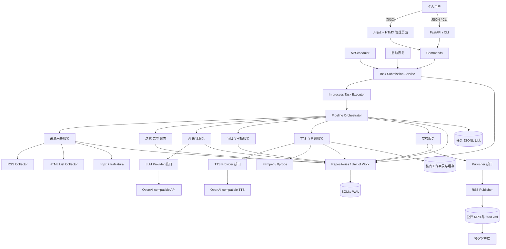
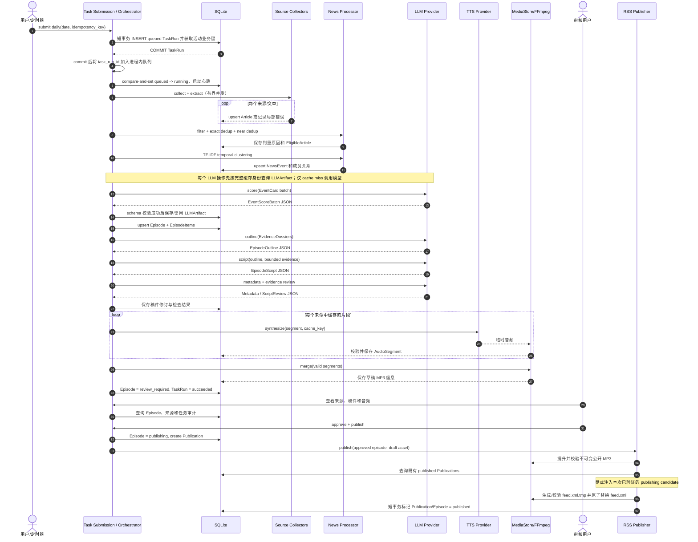
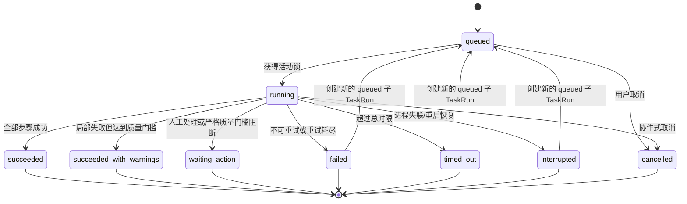
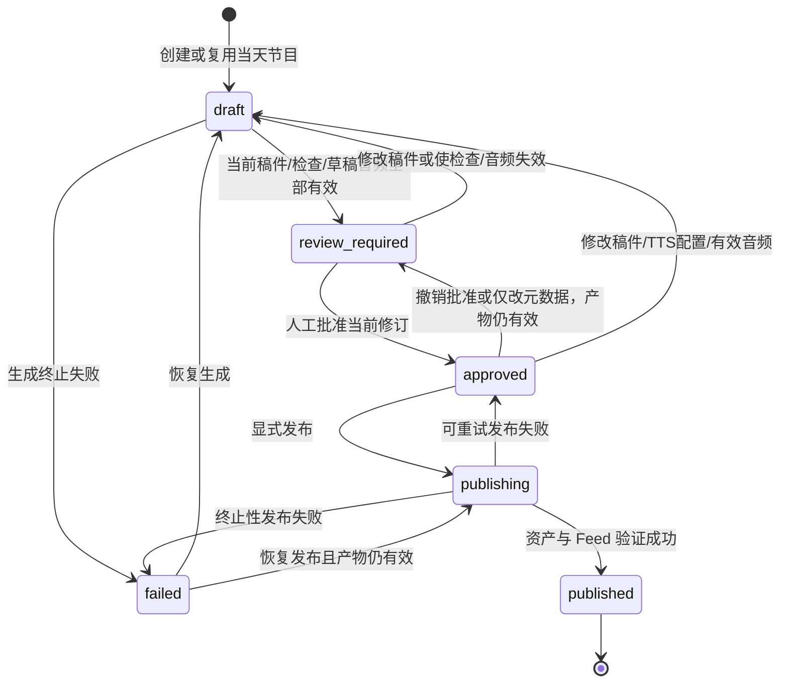

# DailyCast V1 技术设计

- 文档状态：设计完成，待评审
- 版本：1.0
- 日期：2026-07-22
- 关联文档：[PRD](./PRD.md)、[数据模型](./data-model.md)、[管理 API](./api.md)、[项目结构](./project-structure.md)

## 1. 设计原则

1. **完整闭环优先**：V1 必须真正完成采集、处理、生成、音频、审核和 RSS 发布，而不是只做其中最显眼的 AI 调用。
2. **模块化单体优先**：一个进程和一个数据库降低部署、调试和恢复成本；模块边界为未来替换实现服务，不提前拆网络服务。
3. **确定性代码在前，模型在后**：能用规则、哈希、时间窗和本地算法解决的问题不交给 LLM。
4. **人工审核是发布闸门**：AI 输出不直接成为公开节目，`review_required -> approved` 必须由用户触发。
5. **状态先于副作用**：长步骤有持久化检查点；外部调用、文件生成和发布均使用幂等键或内容地址。
6. **失败隔离**：单来源、单文章、单音频片段失败默认是局部问题；只有达不到节目最低质量门槛才失败整期。
7. **公开资产不可变**：已发布音频 URL、内容和 GUID 长期稳定；修改通过新资产或新节目修订表达。
8. **接口隔离外部依赖**：LLM、TTS、MediaStore 和 Publisher 通过项目协议接入。
9. **默认有界**：候选数、正文长度、模型调用、Token、重试、并发、任务时间和响应体大小都有硬上限。
10. **YAGNI**：不为单用户、单实例系统引入队列、缓存服务、微服务或前端构建链。

## 2. 架构方案比较

评分含义：5 最适合 DailyCast V1，1 最不适合。

| 维度 | Python 模块化单体 | Go API + Python Worker | 完全依赖 Dify 工作流 |
|---|---:|---:|---:|
| 开发速度 | 5：同一语言和进程完成 Web、抓取、AI、音频编排 | 2：需定义跨进程协议并维护两套工程 | 4：AI 节点搭建快，外围能力仍需补代码 |
| 完成度 | 5：可覆盖数据库、审核、文件、Feed 和恢复 | 4：能力足够，但 V1 集成面扩大 | 2：音频、稳定文件、审核状态和 RSS 仍需外部系统 |
| 部署复杂度 | 5：一个服务、SQLite、两个目录卷 | 2：至少两个运行时、IPC/HTTP 和进程协调 | 2：增加 Dify 及其依赖，同时仍需本地服务 |
| 调试难度 | 5：一个 TaskRun 可贯穿调用栈和日志 | 2：跨语言 trace、失败归属和版本匹配更难 | 2：工作流运行日志与本地状态容易割裂 |
| 长期维护 | 4：边界清楚即可逐模块替换 | 3：服务边界稳定后有价值，但早期成本高 | 2：受工作流平台版本、导入导出和部署形态约束 |
| 展示价值 | 5：展示完整 AI 应用工程与可靠性设计 | 4：技术面广，但可能显得过度设计 | 3：能展示编排，较少展示底层工程能力 |
| 后续扩展 | 4：Provider/Publisher 接口可演进 | 5：高负载时独立扩缩容更自然 | 3：适合迭代 AI 流程，不适合承载所有领域状态 |
| 运行成本 | 5：单进程、无中间件 | 3：额外进程和运维成本 | 2：Dify 自托管栈或托管服务成本更高 |

### 明确推荐

V1 选择 **Python 3.12 模块化单体**。新闻解析、LLM/TTS SDK、FastAPI、APScheduler、SQLAlchemy 和音频编排在 Python 生态中已经足够成熟；单体使事务、幂等和失败恢复围绕同一 SQLite 状态源完成。模块间仍通过服务和 Provider 协议隔离，因此未来只有在实际出现独立扩缩容、故障域或团队边界时，才需要把某个模块拆成服务。

Go API + Python Worker 没有解决 V1 的新问题，反而立刻带来进程通信、双语言模型、部署和可观测性成本。完全依赖 Dify 能快速演示 Prompt 链，但无法自然拥有 DailyCast 的节目状态、分段音频缓存、不可变发布资产和本地恢复语义。

## 3. 总体架构

### 3.1 运行单元

V1 只有一个 DailyCast 应用容器/进程：

- FastAPI 同时提供 JSON API、Jinja2 + HTMX 管理页面、公开音频和 Feed；
- APScheduler 位于同一进程，仅在数据库 revision 正确且非 reload 开发模式时注册 Cron 触发器；
- Pipeline Orchestrator 同步掌控步骤，但外部 I/O 使用异步客户端并限制并发；
- 一个进程内 Task Executor 维护单个重型任务并发槽。API 先提交 TaskRun 短事务再启动协程，因此可以立即返回 202；启动时扫描遗留 `queued` 行，避免“已入库但协程尚未启动”导致任务丢失；
- SQLite 是业务状态和审计摘要的唯一真相源；
- 本地持久化目录保存工作音频、缓存、任务 JSONL 日志和公开资产；
- FFmpeg 作为受控子进程执行音频校验与合并。

Uvicorn 必须使用一个 worker，APScheduler 配置 `max_instances=1`、`coalesce=true` 和显式时区。数据库的活动任务唯一索引是最终并发保护，避免 API、定时触发和启动恢复同时创建同一任务。三个入口都必须经过 `TaskSubmissionService`。应用不通过 `Base.metadata.create_all()` 建表；Alembic revision 不匹配时不启动调度器或执行器，并关闭所有非诊断业务端点。

### 3.2 总体架构图



## 4. 模块职责与依赖

| 模块 | 核心职责 | 依赖 | 不负责 |
|---|---|---|---|
| Entry/API/Web/CLI | 请求校验、响应映射、页面呈现 | 应用服务、配置 | SQL、Prompt、重试、文件写入 |
| Scheduler | 把 Cron 转换为提交命令，并通过统一入口竞争活动业务键 | `TaskSubmissionService` | 业务步骤和恢复判断 |
| Pipeline | 顺序执行步骤、超时、检查点、恢复、任务幂等 | 各领域服务、Task repository | 供应商协议细节 |
| Sources | 发现候选、下载、提取正文 | httpx、feedparser、trafilatura、Source/Article repository | 去重、选题 |
| News | 规范化、过滤、基础去重、相似聚类、代表文章 | 本地算法、Article/Event repository | LLM 评分 |
| LLM/Editorial | 事件卡片、预算、Prompt、结构化生成和审核；按完整身份查询/保存已验证 LLMArtifact | `LLMProvider`、LLMArtifact repository | 调度、持久文件、TTS |
| Episodes | Episode/EpisodeItem 生命周期、修订、审核闸门 | repository、编辑服务 | HTTP 和供应商 SDK |
| TTS/Media | 稳定分段、缓存、片段重试、音频校验和合并 | `TTSProvider`、MediaStore、FFmpeg | 发布平台操作 |
| Publishing | 发布前校验、目标幂等、RSS 生成 | `Publisher`、MediaStore、Publication repository | 新闻理解和生成 |
| DB | ORM、事务、查询、SQLite 设置 | SQLAlchemy | 业务状态迁移决策 |

依赖规则详见 [project-structure.md](./project-structure.md)。模块内可以直接函数调用，不通过 HTTP 或消息中间件。

## 5. 完整数据流

### 5.1 数据分层

```text
Source
  -> ArticleCandidate（内存 DTO，数量上限）
  -> Article（SQLite，原始与提取状态）
  -> EligibleArticle（确定性过滤结果）
  -> NewsEvent（本地聚类）
  -> EventCard（限长，供评分）
  -> EvidenceDossier（仅入选事件，限长证据包）
  -> Episode + EpisodeItem（草稿和可追溯关系）
  -> ScriptRevision（结构化稿件）
  -> AudioSegment（内容寻址片段）
  -> Draft MP3（私有）
  -> Public immutable MP3 + feed.xml
```

### 5.2 流程与默认门槛

1. **触发**：生成业务键 `daily:{local_date}:{edition}:{pipeline_version}`，若存在活动 TaskRun 则返回该运行；若已有 Episode 则复用。
2. **采集**：对启用来源并发获取，默认来源并发 4、单主机并发 2、响应体最大 5 MB；每个来源产出数量受限。
3. **提取**：RSS 正文不足时下载文章页，保留纯文本；默认不保存原始 HTML。
4. **确定性过滤**：默认发布时间最近 36 小时、正文至少 500 个 Unicode 字符；阈值均可按来源覆盖。
5. **基础去重**：按 URL、标题、正文哈希和近重复指纹标记；重复文章不进入聚类，但保留 `duplicate_of_article_id`。
6. **聚类**：在 48 小时时间窗内对“标题 + 摘要 + 正文前 1,500 字符”做 TF-IDF 字符 2–4 gram 相似度图，默认余弦阈值 0.58；连通分量形成事件。不同日期的候选不会无限互相吸附。
7. **确定性预排序**：综合来源优先级、来源数、时效、正文完整度和重复报道数，最多保留 30 个事件供 LLM。
8. **LLM 评分**：发送 EventCard，不发全部正文。模型输出重要性、相关性、时效性、可信度、推荐与入选理由；代码校验并按规则选最多 8 个。
9. **证据包**：只为入选事件构建 EvidenceDossier，每个事件包含代表摘要、最多 3 个来源、每来源最多 1,200 字符片段、明确 article ID 和原始链接。
10. **大纲和稿件**：模型先返回结构化大纲，再按大纲生成结构化稿件；每节声明 `event_ids`、`article_ids` 和关键 claim。
11. **检查**：代码先做 schema、引用、数字、长度和时长检查；LLM 再做基于证据包的语义审校。问题需要修订时最多自动回写一次。
12. **TTS**：稿件按段落/句子稳定切段。命中缓存的有效片段直接复用，其余逐段生成并 `ffprobe` 校验。
13. **合并**：FFmpeg 按固定声道、采样率和比特率生成草稿 MP3，写入临时文件，校验后原子替换。
14. **待审**：Episode 进入 `review_required`，生成任务可成功结束；等待人工不是一个长期占用的 TaskRun。
15. **批准与发布**：批准只改变状态。发布是独立 TaskRun，先提升不可变公开资产，再生成、校验和原子替换 Feed，最后写 Publication 和 Episode 状态。

### 5.3 每日节目生成时序图



## 6. 新闻去重与语义聚类

### 6.1 基础去重

基础去重是确定性的，并在 LLM 之前完成：

1. URL 规范化：scheme/host 小写、IDN 规范化、移除 fragment 和默认端口、排序 query，删除 `utm_*`、`fbclid`、`gclid` 等追踪参数；仅在安全规则允许时采用页面 canonical URL。
2. `url_hash = SHA-256(normalized_url)`，数据库全局唯一，重复发现执行 upsert。
3. 标题经 Unicode NFKC、空白折叠、大小写和标点规范后生成 `title_hash`；只在 72 小时时间窗内作为重复证据。
4. 正文经 Unicode/空白规范和模板噪声移除后生成 `content_hash`；相同正文直接标记重复。
5. 对剩余候选计算 64-bit SimHash。相同语言且时间接近时，汉明距离不超过 3 或字符 3-gram Jaccard 不低于 0.90 视为近重复。
6. 保留质量更高的主文章：来源优先级、正文完整度、发布时间可信度、抓取成功时间依次决胜。

基础去重回答“是不是同一篇或几乎相同的稿件”，不会把不同媒体对同一事件的独立报道删除。

### 6.2 语义聚类

语义聚类回答“是否在报道同一事件”：

- 输入只包含基础去重后的文章；
- 特征为加权标题、摘要和正文前部，使用 TF-IDF 字符 n-gram，避免依赖分词词典；
- 先按发布时间窗和语言分桶，再计算小规模余弦相似度；
- 达到阈值的文章形成无向图，以连通分量为初始事件；
- 对过大的链式簇应用代表文章相似度下限，防止主题相近但事件不同的文章被串联；
- 事件代表文章按质量规则确定，`event_key` 使用当期日期与最早成员 Article ID，重跑时稳定；
- Episode 创建后冻结其 EpisodeItem 快照。后续新增文章可更新 NewsEvent，但不能暗改已发布节目。

V1 规模下本地 TF-IDF 足够；不引入向量数据库或每篇 embedding 调用。阈值和算法版本写入 NewsEvent，便于回放与比较。

## 7. LLM 使用边界与结构化协议

### 7.1 必须使用 LLM 的步骤

- 多维事件编辑评分、是否值得播报及自然语言理由；
- 将入选事件组织为连贯节目大纲；
- 生成适合中文口播的稿件；
- 生成节目标题和简介；
- 基于保存证据检查语义、事实支持关系、重复和表达问题。

这里“事实检查”仅表示检查稿件 claim 是否被给定来源支持，不代表联网核实绝对真伪。

### 7.2 应使用普通代码的步骤

- 请求、RSS/HTML 解析、正文提取、URL 规范化；
- 时间与长度过滤、哈希和近重复判断、TF-IDF 聚类；
- 来源优先级、候选上限、Token 预算和最终条数约束；
- JSON schema 校验、引用完整性、数字可追溯性和状态迁移；
- 稿件分段、缓存、TTS 调用编排、FFmpeg 合并；
- 数据库、幂等、重试、日志、审核、Feed 和 Publisher 编排。

### 7.3 V1 Provider

`LLMProvider` 提供一个供应商无关操作：

```text
generate_structured(
  operation,
  messages,
  response_schema,
  model_options,
  idempotency_context
) -> StructuredResult
```

V1 的 `OpenAICompatibleLLMProvider` 支持：

- `base_url`、环境变量引用的 `api_key`、`model`；
- 连接/读取/总超时；
- 每操作 temperature、可选 top_p、最大输出 tokens 和其他受支持的模型选项；
- Provider 支持时使用 JSON Schema response format，不支持时退化为 JSON 模式并本地严格校验；
- 记录 provider、模型、提示词版本、schema 版本、`generation_config_hash`、输入/输出哈希、用量和供应商 request ID，不记录秘密或明文 endpoint。

### 7.4 每一步输入输出

| 操作 | 有界输入 | 结构化输出 | 默认 temperature |
|---|---|---|---:|
| `score_events` | 最多 30 个 EventCard；每卡标题、400 字摘要、来源数/优先级、时间、最多 2 个短片段 | `{schema_version, scores:[{event_id, importance, relevance, timeliness, confidence, recommend, reason, risks}]}` | 0.1 |
| `generate_outline` | 最多 8 个 EvidenceDossier + 时长/风格约束 | `{title_angle, target_seconds, sections:[{section_id,type,event_ids,goal,key_facts,seconds}]}` | 0.3 |
| `generate_script` | 已校验大纲 + 分批证据包；总输入受限 | `{sections:[{section_id,text,event_ids,article_ids,claims:[{text,article_ids}]}], pronunciation_hints}` | 0.5 |
| `generate_metadata` | 稿件摘要、事件标题和时长，不再传全文 | `{title, description, keywords}` | 0.4 |
| `review_script` | 结构化稿件 + 对应证据片段 + 代码检查结果 | `{verdict, issues:[{severity,type,section_id,message,article_ids}], suggested_changes}` | 0.0 |

所有 ID 必须来自请求白名单；模型产生未知 ID、额外字段、越界分数或无来源 claim 时响应无效。自动修订最多一次，不能形成模型自我重试循环。

### 7.5 Token 与调用成本控制

默认策略：

- 原始 300 篇 -> 确定性合格 100 篇 -> 聚类后预排序 30 个事件 -> 最多 8 个入选事件；
- EventCard 只含短摘要和极少证据，入选后才构造 EvidenceDossier；
- 每来源片段和每事件证据有字符上限，优先保留含数字、主体和动作的句子；
- 使用 tokenizer 在调用前估算，按操作分配预算；不以字符数冒充最终 Token 计量；
- 默认每期最大 12 次 LLM 调用、60,000 输入 tokens 和 15,000 输出 tokens；达到硬限制抛出 `AI_BUDGET_EXCEEDED`；
- 评分按固定批次，脚本按 1–3 个连续 section batch 生成，默认总调用约 5–8 次；
- 成功响应以 `operation + provider + model + prompt_version + schema_version + generation_config_hash + input_hash` 作为唯一缓存身份；
- schema 修复重试也计入调用预算；网络失败且供应商确认未受理时不计模型用量，但仍计尝试次数；
- 管理页显示估算/实际 Token 和每步调用数。

这套漏斗避免把几十篇完整正文直接发给 LLM，也让费用和失败面可预测。

### 7.6 LLMArtifact 持久化复用

成功的结构化模型结果保存为 `LLMArtifact`。调用前，AIEditorialService 将已经限长和规范化的结构化输入序列化为 canonical JSON 并计算 `input_hash`，再用以下完整身份查询：

```text
operation + provider + model + prompt_version + schema_version + generation_config_hash + input_hash
```

`generation_config_hash` 的唯一规范是对下列非敏感对象按键排序、统一数字/空值表达并序列化为 UTF-8 canonical JSON 后计算 SHA-256：

```text
{
  endpoint_identity_hash,
  temperature,
  top_p_or_null,
  max_output_tokens,
  response_format_or_structured_output_mode,
  provider_model_options_sorted
}
```

`endpoint_identity_hash` 先对 endpoint 的 scheme、host、规范端口、base path 和允许保留的非敏感 query 做规范化，再计算 SHA-256。含 userinfo 或疑似 credential/token/signature 的 query 必须拒绝或移除；数据库和日志只保存此身份 hash，不保存可能带凭证的明文 URL。API Key、Authorization、timeout、连接参数和 retry 次数既不进入 generation config，也不得保存。`provider_model_options_sorted` 只收录实际影响模型结果语义的选项；运维型传输参数排除在外。

- 只有 `output_json` 通过该 `schema_version` 对应的本地 schema 校验后，才能写入 LLMArtifact；表中没有 pending/failed 状态，行存在即表示成功且可复用。
- cache miss 才调用 Provider。并发写入遇到唯一约束冲突时读取已存在的成功行，不重复创建。
- TaskRun 恢复和后续新 TaskRun 使用同一 repository 查询，因此复用不局限于父任务检查点。
- provider、model、prompt_version、schema_version、generation config 或 canonical input 任一变化都会形成不同缓存身份，不能命中旧结果。Prompt 内容每次修改必须提升 prompt_version，并由测试验证注册版本与内容一致。
- `output_json` 是有界结构化结果；不保存系统密钥、Authorization、未经限制的完整原始 Prompt 或全部新闻正文。`input_hash` 只证明输入身份，不反向存储原始 Prompt。
- cache hit 不增加当前 TaskRun 的模型调用数或 Token 用量，但 TaskStep `details_json` 记录 cache hit 数量和 artifact ID。
- 默认保留 180 天。Event、Episode 等业务实体已经保存所需输出快照，因此过期清理 LLMArtifact 只降低缓存命中率，不破坏已生成节目。进程内 scheduler 每天 03:30 在没有活动重型 TaskRun 时调用 LLMArtifactRepository，按 `created_at` 每批最多 500 行清理并写结构化汇总日志；它不是新的进程服务，也不提供管理 API 直接编辑或删除。

## 8. Dify 边界

### 8.1 为什么 V1 不直接接入 Dify

V1 只有一条明确 AI 流程，直接调用 OpenAI 兼容 API 的依赖更少、结构化输出更容易测试，调用用量和提示词版本也能与 TaskStep 同源记录。引入 Dify 会额外部署工作流服务及其依赖，却仍无法替代 SQLite 业务状态、片段缓存、FFmpeg、审核状态和稳定 RSS 资产，反而形成两个控制面。

### 8.2 后续 `DifyWorkflowProvider`

未来实现 `DifyWorkflowProvider` 时：

- 它仍实现同一个 `LLMProvider.generate_structured` 协议；
- `operation` 映射到配置中的 workflow ID，输入使用现有 EventCard/EvidenceDossier schema；
- Dify 输出必须映射并通过现有本地 schema 校验；
- TaskRun、Episode、提示词/工作流版本、预算和审计仍由 DailyCast 保存；
- 失败仍转换为 DailyCast 错误分类和重试语义。

Dify 不承担调度，因为本地还需协调数据库和音频检查点；不承担存储，因为 Episode/Publication 是系统真相；不承担音频，因为分段缓存、FFmpeg 和公开资产需要本地原子与幂等保证。这样切换 Provider 不改变 API、数据模型、状态机和发布流程。

## 9. TTS 与音频设计

### 9.1 Provider 默认选择

V1 实现 `OpenAICompatibleTTSProvider`。理由是配置与 LLM 类似、请求模型清晰、易用 Fake Server 做契约测试，也便于替换到兼容服务。Edge TTS 可作为 V1.2 Provider，但不把依赖非正式 Web 服务行为作为首个稳定基线。

接口输入包含 `text`、`model`、`voice`、`speed`、`format` 和超时；输出包含临时文件、MIME、字节数、供应商 request ID。Provider 不决定分段、缓存路径或 Episode 状态。

### 9.2 稳定分段与缓存

1. 稿件保存 `script_revision` 和 `script_hash`。
2. 分段器优先保持段落边界，再按中文句号、问号、感叹号和安全长度切分；同样输入与算法版本得到同样片段。
3. `provider_config_hash` 的唯一规范是对 `{provider_implementation_identity, endpoint_identity_hash, semantic_provider_options_sorted}` 做 canonical JSON SHA-256。endpoint 采用与 LLM 相同的脱敏规范化身份 hash；语义选项包括 Provider 特有且影响音频结果的参数。API Key、Authorization、timeout 和 retry 次数均排除。
4. `tts_preprocess_hash` 是发音词典、金融数字规则、增强断句模式及其他影响口播输入的 non-secret canonical hash；timeout 和 retry 不参与。公开 `edge-tts` SDK 会转义调用者文本、不能接收自定义 SSML，因此模式名称为 `enhanced_text`：仅传递经过断句增强的纯文本，不声称发送 SSML。
5. 缓存键的唯一公式为 `SHA-256(provider + provider_config_hash + model + voice + canonical_speed + format + segmenter_version + tts_preprocess_hash + normalized_text)`。provider、model、voice、speed 和 format 即使也被 Provider 请求使用，仍显式保留在公式中；`provider_config_hash` 只承载实现/endpoint 和额外语义选项，避免双重定义。
6. 每段只按上述完整 `cache_key` 和匹配的 `provider_config_hash + tts_preprocess_hash` 查询 `succeeded` 缓存，并再次验证文件 checksum/解码；不得使用缺少 Provider 或预处理配置语义的旧 cache_key。未命中才调用 TTS。
6. 片段先写 `.part`，完成后校验 MIME、解码、时长和 checksum，再原子改名并置为 `succeeded`。
7. 重试只处理 `pending/failed/stale` 或文件校验失败片段。

用户修改稿件时，系统重新稳定分段并按缓存键匹配历史片段。文本未变的片段即使位置变化也复用；文本改变或因边界变化而内容改变的片段重新生成。最终 MP3 总是重新合并，因为顺序或时长可能改变。

### 9.3 重试与合并

- 网络、429、5xx 最多重试 3 次，指数退避加 jitter，尊重 `Retry-After`；认证、配额耗尽、非法音色和输入过长不自动重试。
- 单段状态和文件在每次成功后立即提交，绝不等待整期完成才保存。
- FFmpeg 对一致格式片段按固定参数重新编码为最终 MP3，避免简单字节拼接导致时间戳或播放器兼容问题。
- 最终文件写临时路径，`ffprobe` 验证可解码、总时长合理且非空，再原子提升为 draft asset。
- 手动单段再生即使文本未变也使用 `force_nonce` 绕过缓存，但只替换草稿关联，不删除旧缓存。

## 10. 任务模型与状态机

### 10.1 TaskRun 与 TaskStep

TaskRun 表示一次可审计执行；TaskStep 表示一次步骤尝试。每日生成和发布是两个 TaskRun，人工等待不占用执行器。

TaskRun 状态：`queued`、`running`、`waiting_action`、`succeeded`、`succeeded_with_warnings`、`failed`、`timed_out`、`interrupted`、`cancelled`。`waiting_action` 是非失败终态：保留已经写入的 artifact，并停止所有依赖后续步骤。

TaskStep 状态：`pending`、`running`、`succeeded`、`succeeded_with_warnings`、`failed`、`skipped`。

每日生成步骤顺序：

```text
collecting -> extracting -> deduplicating -> clustering -> ranking
-> outlining -> scripting -> checking -> synthesizing -> assembling -> reviewing
```

发布任务步骤：

```text
validating -> promoting_asset -> publishing -> verifying
```

`reviewing` 表示把产物整理为人工审核状态，不表示任务阻塞等待人操作。

### 10.2 任务状态图



续跑使用新的 TaskRun 和 idempotency key，并记录 `parent_task_run_id`；它复用原 Episode、Article、NewsEvent 和有效音频。原失败运行保持不可变审计记录。

### 10.3 防重复运行

- TaskRun 有业务键，SQLite 建立“状态为 queued/running 时 business_key 唯一”的部分唯一索引；
- 入口先在短事务中创建 TaskRun，唯一冲突时返回已有活动运行；
- APScheduler 自身 `max_instances=1` 只是第一道保护，不是最终正确性来源；
- 单进程内再使用按 business_key 的 asyncio lock，减少无意义数据库冲突；
- 不允许多 Uvicorn worker，也不支持多个 Compose 副本共享同一 SQLite 文件。

### 10.4 总超时

TaskRun 保存 `deadline_at`，由 `task_execution.deadline_seconds` 在提交时计算。每个步骤、文章请求、LLM、TTS 和 FFmpeg 都有更小的超时。Orchestrator 在领取 queued 任务、每个步骤开始前和每个步骤完成后检查 deadline；超过时写入 `timed_out/TASK_DEADLINE_EXCEEDED`，不把内容或配置问题伪装成可重试失败。非协作式外部调用仍受自身 timeout 约束；超时任务已成功的检查点保留，可创建续跑任务。

### 10.5 进程内提交、恢复、心跳与关闭

V1 使用一个进程内有界队列和一个重型任务执行槽，不引入 Redis、Celery 或独立 Worker 服务。SQLite 中的 TaskRun 是持久真相，内存队列只保存待唤醒的 `task_run_id`。

#### API/调度提交顺序

1. API、APScheduler 或启动恢复都调用同一个 `TaskSubmissionService`，先规范化请求、计算 idempotency key 和 business key。
2. Submission Service 开启短事务，尝试插入 status=`queued` 的 TaskRun。活动 business key 部分唯一索引冲突时返回现有 queued/running TaskRun；相同 idempotency key 但请求 fingerprint 不同则返回冲突。
3. **必须先提交 SQLite 事务，再把 `task_run_id` 放入进程内队列。** 不允许先 enqueue 再落库，否则 worker 可能读取不存在的任务。
4. commit 成功后使用 `put_nowait`/有界 enqueue 唤醒执行器。若进程恰在 commit 后、enqueue 前退出，TaskRun 仍安全地留在 queued；启动扫描会重新加入队列。
5. worker 取到 ID 后用 compare-and-set 将 queued 改为 running。状态已改变或锁不属于该业务键时跳过该队列项；成功后才开始步骤。

队列满不会回滚已经提交的 TaskRun；Submission Service 不把未被队列接受的 ID 标成已投递。执行器会在启动、队列空闲轮询和每次任务结束后从 SQLite 扫描 queued 行并重新投递，因此 QueueFull 不会使持久任务滞留到下一次重启。队列不是状态源，也不持久化业务 payload。

#### 启动恢复与心跳

- 只有 Alembic revision 等于代码 head 时才启动恢复、Task Executor 和 APScheduler。
- 启动时先扫描所有 queued TaskRun 并加入队列；再扫描 heartbeat 过期的 running TaskRun。
- running worker 每 15 秒用独立短事务更新 `heartbeat_at`，即使正在等待 LLM/TTS HTTP 响应也由独立 heartbeat coroutine 更新。连续 60 秒没有心跳视为 stale。
- 单 worker 由进程内 supervisor 监督。单个 TaskRun 的未预期异常在 worker 边界记录并隔离；worker loop 自身异常会由 supervisor 重启。`/readyz` 同时检查 supervisor 与当前 worker 存活，不能在唯一执行槽失效时报告就绪。
- stale running TaskRun 在事务中标记为 interrupted；若其 deadline 已经过期，则直接标记为 `timed_out/TASK_DEADLINE_EXCEEDED` 而不创建恢复子任务。仍在 deadline 内且允许恢复时，创建一个 parent 指向旧运行的 queued TaskRun。自动恢复 idempotency key 由旧 TaskRun ID 派生，重复启动不会创建多个恢复任务。
- 发布恢复必须先执行 Publication reconcile；不能因为进程中断直接重复上传或重复写 Feed。

#### SIGTERM 和优雅关闭

1. 收到 SIGTERM 后立即把实例置为 `shutting_down`，API 拒绝新的长任务提交，APScheduler pause，dispatcher 和 worker 不再领取新任务。
2. 当前步骤获得默认 30 秒 `shutdown_grace_seconds` 完成或到达安全检查点；HTTP 和 FFmpeg 操作同时受各自更短超时约束。
3. 若当前步骤在期限内完成，先提交步骤 checkpoint。若整条任务尚未完成，主动将 TaskRun 标为 interrupted 后退出；下次启动按恢复规则创建子任务。
4. 超过关闭期限仍未完成时，容器可以终止进程，不伪造成功或失败。TaskRun 保持 running；下次启动等心跳超过 60 秒阈值后判定 interrupted。
5. 关闭期间尚未执行的 queued TaskRun 保持 queued，由下次启动扫描恢复。

#### 单实例与 reload 约束

- APScheduler、API 手动触发和启动恢复都依赖数据库活动 business key；`max_instances=1` 和进程内 lock 只减少冲突，不能替代数据库约束。
- 生产只允许单 Uvicorn worker、单 DailyCast 应用实例。多个 Compose 副本或共享 SQLite 的多个进程不受支持。
- 开发使用 `uvicorn --reload` 时必须显式关闭 scheduler；只有 reload 的服务子进程 lifespan 可以启动一个 Task Executor，reload 监视进程不得启动 scheduler 或提交任务。
- 定时任务联调使用无 reload 的单进程开发命令，避免文件变更反复触发 scheduler 注册。

## 11. Episode 状态机

### 11.1 状态语义

- `draft`：当前稿件修订、检查结果或草稿音频至少一项尚未生成、已失效或未通过；不可批准或发布。
- `review_required`：当前 `script_revision` 的稿件、检查结果和草稿音频全部有效，等待人工。
- `approved`：用户确认当前 `script_revision` 和 `audio_version`；允许发布。
- `publishing`：发布副作用进行中。
- `published`：公开 MP3 和 Feed 已验证，Publication 成功。
- `failed`：节目生成或发布遇到终止性错误；可通过恢复回到 draft/publishing。

### 11.2 节目状态图



批准记录绑定 `script_revision` 和 `audio_version`。人工修改稿件时必须原子地增加 `script_revision`，清空 `approved_script_revision`、`approved_audio_version` 和 `approved_at`，清空旧 `review_json`，清除 Episode 当前草稿音频引用并把旧修订的 AudioSegment 标为历史/失效，然后进入 `draft`。重新检查当前修订、生成所有缺失片段并完成最终合并后，才允许进入 `review_required`。

从 `approved` 单纯撤销批准时，若稿件、检查结果和草稿音频仍与当前修订匹配，则只清空批准字段并回到 `review_required`。修改稿件、音色、语速、TTS model 或任何当前有效音频片段会使音频或检查链失效，必须进入 `draft`。标题/简介修改不改变音频，但新公开元数据仍需确认，因此清空批准字段并进入 `review_required`，不进入 `draft`。V1 将已发布 Episode 视为不可变：元数据或音频需要修正时创建新 edition/新 GUID 发布，不原地覆盖订阅端可能已经缓存的 item 和 enclosure。

## 12. 错误处理策略

### 12.1 错误分类

| 类别 | 示例 | 默认处理 |
|---|---|---|
| `validation` | 配置、schema、非法状态 | 不重试，展示字段错误 |
| `auth` | API Key 无效、登录失效 | 不自动重试，要求人工处理 |
| `rate_limit` | HTTP 429 | 有界退避，尊重 Retry-After |
| `transient_network` | 超时、DNS 临时失败、连接断开 | 有界重试 |
| `upstream_5xx` | RSS/LLM/TTS 服务错误 | 有界重试 |
| `content` | 正文太短、无法解析、无发布时间 | 文章级过滤/警告 |
| `budget` | Token/调用上限 | 不重试，调整输入或人工决定 |
| `state_conflict` | 重复任务、错误 Episode 状态 | 返回已有对象或 409 |
| `storage` | 磁盘满、权限、checksum 不匹配 | 终止相关步骤，修复后续跑 |
| `tooling` | FFmpeg 缺失、编码失败 | readiness 失败或步骤终止 |
| `future_rpa_human_action` | 未来 RPA 阶段的验证码/风控；非 V1 错误类别 | 未来扩展的 Publication `needs_attention`；V1 不产生该状态 |

所有错误进入统一 `DailyCastError` 映射，包含稳定错误码、用户可读摘要、retryable、公开细节和仅日志可见的 cause。日志不保存密钥或完整供应商响应。

V1 Publication 状态严格只有 `pending`、`publishing`、`published`、`failed`。上表的 RPA 人工处理类别仅说明未来边界，不进入 V1 初始状态机、DDL、API 或实现。

### 12.2 局部失败门槛

网页抓取失败不应默认导致整期失败。每篇 Article 独立记录状态；采集/提取步骤可以 `succeeded_with_warnings`。只有下列情况失败整期：

- 所有启用来源均失败；
- 确定性过滤后不足配置的最小候选事件数（默认 3）；
- 入选事件缺少可引用正文，无法形成证据包；
- LLM、TTS、存储或 FFmpeg 在重试后仍无法生成可审核产物；
- 检查发现阻断级问题且一次自动修订后仍未解决。

“生成较短一期”还是“失败”由明确的 `min_publishable_events` 决定，不由异常数量模糊判断。

## 13. 重试、检查点与幂等

### 13.1 重试原则

- 只重试可能自然恢复的错误；认证、配置、非法输入和预算错误不重试。
- HTTP/LLM/TTS 默认最多 3 次，退避 1s、3s、9s 加 jitter，并受 TaskRun deadline 限制。
- 结构化 LLM 输出错误可追加一次受限“schema repair”请求，它计入预算；仍失败即终止。
- 文章级重试不回滚已经成功的其他文章。
- 每个步骤只在自身事务内提交，长外部调用期间不持有 SQLite 写事务。

### 13.2 业务幂等键

| 副作用 | 幂等策略 |
|---|---|
| 每日运行 | `daily:{date}:{edition}:{pipeline_version}` 活动唯一 |
| Episode | `(episode_date, edition)` 唯一，重复任务 upsert |
| Article | `url_hash` 唯一；正文哈希标记 duplicate |
| NewsEvent | `event_key` 唯一；成员 upsert |
| EpisodeItem | `(episode_id, event_id)` 唯一 |
| LLM 结果 | LLMArtifact 对 `(operation, provider, model, prompt_version, schema_version, generation_config_hash, input_hash)` 建唯一约束；仅 schema 校验成功后写入 |
| AudioSegment | Episode 修订内 `(episode_id, script_revision, segment_index)` 唯一；跨修订只用包含 `provider_config_hash` 的完整 cache_key 复用 |
| 草稿 MP3 | 保存于私有 `DATA_DIR/audio/drafts/{episode_id}/revision-{script_revision}.mp3`，原子替换当前 draft 引用，绝不写入 `PUBLIC_DIR` |
| Publication | `(episode_id, publisher_type, target_key)` 唯一；重复调用先 reconcile |
| Feed item | Episode `public_id` 作为稳定 GUID；按 GUID upsert，不 append 重复项 |

### 13.3 从失败步骤恢复

新 TaskRun 读取父运行的检查点并验证依赖指纹：

- 子任务复制父运行的脱敏配置快照和 fingerprint，并按根到当前的 `parent_task_run_id` 链读取 TaskStep checkpoint。每个逻辑步骤只采用该谱系中**最新一次**成功/警告成功尝试；较新的 failed/running 尝试会使该步骤从最早失效点重跑。恢复时只恢复可验证的持久对象 ID；产生 `data/work/{task_run_id}` 私有 editorial 文件的步骤在子任务自己的根目录重跑（LLMArtifact/音频缓存仍可复用），绝不把新输出写入父任务目录。下游再次加载时继续执行结构/schema 与文件校验，不能仅凭步骤名称跳过。
- 原来源配置快照未变且 Article 已保存，跳过成功采集；
- 聚类算法/候选集合变化则从 clustering 重跑；
- provider、模型、Prompt 版本、输出 schema 版本、generation config 或证据输入哈希变化时不能复用旧 LLMArtifact，并使对应 LLM 步骤及下游失效；
- 稿件不变且完整音频缓存身份相同时才复用 TTS 片段；Provider 实现/endpoint、额外语义参数、音色、语速、模型或格式变化使对应音频 cache miss；
- 公开资产只在发布完成后视为不可变，未完成 Publication 先 reconcile 文件和 Feed 状态。

续跑默认使用父 TaskRun 的配置快照以保证可重复；用户选择“按当前配置重建”时创建新的 pipeline version/business key，并仍复用安全的 Article 原始数据。

## 14. 文件存储策略

```text
data/
├── dailycast.db
├── work/{task_run_id}/                     # 可清理临时文件
├── audio/
│   ├── drafts/{episode_id}/revision-{script_revision}.mp3
│   └── cache/{cache_prefix}/{cache_key}.mp3
└── logs/tasks/{task_run_id}.jsonl

public/
├── feed.xml
└── media/episodes/{episode_public_id}/{audio_asset_id}.mp3
```

### 14.1 SQLite 保存

SQLite 保存可查询、需要事务和关系约束的数据：Source、Article 纯文本、NewsEvent、Episode、EpisodeItem、TaskRun、TaskStep、LLMArtifact、AudioSegment 元数据、Publication、状态、哈希、相对路径、使用量和错误摘要。

### 14.2 文件系统保存

文件系统保存体积大或需要流式访问的数据：私有 `DATA_DIR` 中的 TTS 片段、草稿 MP3、任务 JSONL 和可选调试快照，以及 `PUBLIC_DIR` 中的 Feed 与已经发布的不可变 MP3。数据库只保存相对路径、大小、checksum 和 MIME。草稿路径不得被公开静态路由读取；只有 RSSPublisher 校验后复制到 `PUBLIC_DIR/media/...` 的资产可以公开。默认不保存原始 HTML，以减少版权、XSS 和磁盘风险；需要诊断时可开启短期、非公开、定时清理的快照。

未来对象存储通过 `MediaStore` 替换公开/缓存文件实现；SQLite 中的业务关系和 Publisher 输入不变。V1 不把 MP3 BLOB 放入 SQLite，也不因未来对象存储提前引入 S3 依赖。

### 14.3 生命周期

- `work/`：成功后清理，失败保留 7 天用于诊断；
- TTS cache：默认保留 90 天，仍被 AudioSegment 引用的文件不可清理；
- draft artifacts：Episode 发布 30 天后可清理非当前版本；
- public assets：默认永久保留，删除必须是显式管理操作且先检查 Feed 引用；
- task JSONL：默认保留 90 天，TaskStep 摘要永久随数据库备份保留。

## 15. RSS 发布策略

1. `public_base_url` 是必须配置的绝对 HTTPS URL；文件系统路径与公开 URL 分离。
   首次发布后应把它视为部署身份的一部分。若必须更换域名，迁移方案必须为所有旧 enclosure 配置永久重定向，不能只改配置并假设播客客户端会刷新。
2. Episode 创建时生成不可变 `public_id`，作为 RSS GUID；发布日期不参与 URL。
3. 创建或复用唯一的 `Publication(status=publishing)`；发布事务不得跨文件 I/O。
4. 将校验通过的 draft MP3 提升到 `media/episodes/{public_id}/{audio_asset_id}.mp3` 并再次校验 checksum、字节数和 MIME。`audio_asset_id` 来自最终 checksum 和 UUID；目标已存在时必须验证同一内容后复用，不得复制、覆盖或改写不可变文件。
5. 查询数据库中已有的全部 `published` Publications，以它们构建稳定 Feed 基础集合。正常稳定状态下 Feed 只包含这些成功发布节目。
6. RSSPublisher 把本次已经验证、但数据库仍为 `publishing` 的 Publication 作为**本次候选 item**显式注入内存 Feed 模型。候选不依赖 `published` 查询得到，按 GUID upsert，并拒绝同 GUID 不同 enclosure。
7. 生成 `feed.xml.tmp`，校验 channel/item 必填字段、GUID、enclosure URL、MIME、字节长度、重复项以及每个公开文件确实存在，再用 `os.replace` 原子更新 `feed.xml`。
8. Feed 替换成功后，最后在一个短数据库事务中把当前 Publication 和 Episode 同时标记为 `published`，写入 `published_at/last_verified_at`。若该事务失败，不得回滚或覆盖已经公开的不可变文件/Feed。
9. publish/reconcile 开始时先检查文件和 Feed。若 `feed.xml` 已包含当前 `feed_guid` 且 enclosure URL、MIME、长度和公开文件 checksum 全部正确，而数据库仍为 `publishing`，reconcile 直接在短事务中补写 Publication/Episode=`published`；若 Feed 未包含则按步骤 5–8 重建。按 GUID upsert 保证不重复 item，也不重复复制资产。
10. 已发布 item 的 GUID、元数据和音频 URL 在 V1 中均视为不可变。需要修正元数据或音频时创建新 edition/new item；旧 enclosure 继续保留，避免不同播客客户端看到互相矛盾的缓存。
11. FastAPI 可在个人规模下提供静态文件；公网长期运行建议由 Caddy/Nginx 直接服务 `public/`，但不是 Compose 必需组件。

## 16. 未来 Publisher 与 RPA 策略

### 16.1 Publisher 接口

`RSSPublisher`、未来 `PodbeanAPIPublisher` 和 `NetEasePlaywrightPublisher` 都实现：

```text
validate(approved_episode, immutable_asset)
publish(request_with_idempotency_key)
reconcile(existing_publication)
```

Publisher 只接收已批准节目、标题简介、来源摘要和最终音频；不接收原始新闻处理权限，也不调用 LLM/TTS。

### 16.2 API First、RPA Fallback

官方 API 有稳定契约、状态码、幂等与可测试性，维护成本和账号风险更低，因此任何平台先评估官方 API。只有没有满足上传需求的稳定官方 API 时，才实现受控 RPA。非官方逆向接口不作为默认方案，因为其认证、合规、稳定性和封号风险不可控。

### 16.3 网易云 Playwright 失败处理

未来适配器使用独立、非仓库内的持久化 browser profile 或加密 secret mount。状态处理如下：

- 登录失效：停止自动发布，Publication 进入 `needs_attention/auth_expired`，引导用户人工重新登录；
- 验证码或风控：不绕过，保存脱敏截图、trace 和当前步骤，进入 `needs_attention/challenge`；
- 页面改版/选择器失配：停止点击，记录页面 URL、预期元素和脱敏截图，进入 `needs_attention/ui_changed`；
- 上传已提交但结果未知：不得直接重传，先通过页面草稿/节目列表 reconcile；
- 人工处理后从安全检查点继续，复用同一 Publication idempotency key。

Cookie、账号和密码绝不写入代码、YAML、日志、截图文件名或数据库配置快照。Playwright 作为 RPA 阶段的可选依赖，不进入 V1 默认镜像。

`needs_attention` 和 `human_action_code` 是未来 RPA 阶段的 Publication 扩展，不属于 V1 初始 schema；实现 NetEase Publisher 时必须通过新的 Alembic revision 增加，不能提前把 Podbean/网易云能力写入 V1 目录树或初始 migration。

## 17. 配置与密钥管理

### 17.1 配置结构

普通 YAML 分为：

- `app`：时区、数据库 URL、数据/公开目录、日志和管理绑定地址；非 Docker 开发默认 `127.0.0.1:8000`，Compose 显式覆盖为容器内 `0.0.0.0:8000`；
- `sources`：来源种子列表、类型、URL、选择器、优先级和过滤覆盖；种子启动时采用 `missing_only` 导入，首次导入后 SQLite Source 是运行时真相源，YAML 不覆盖通过 API 做的修改；
- `llm`：provider、base URL、model、超时、各操作 temperature/top_p/max output tokens、response format、其他模型语义选项、输入/输出与调用预算；加载后分别计算脱敏 endpoint identity 和 `generation_config_hash`；
- `tts`：provider、base URL、Provider 实现身份、model、voice、speed、开场/结尾速度、格式、`plain|enhanced_text` 模式、发音词典、额外音频语义选项、分段上限和重试；加载后分别计算不含秘密/timeout/retry 的 `provider_config_hash` 与 `tts_preprocess_hash`；
- `schedule`：启用、Cron、misfire grace、总任务超时；
- `publishing`：public base URL、Feed 元数据、公开路径、目标列表。

启动时使用 Pydantic Settings/schema 一次性校验并产生不可变运行配置。TaskRun 保存脱敏配置快照和 fingerprint，确保恢复可解释。配置热重载不属于 V1；修改后重启进程。

### 17.2 密钥

YAML 只引用环境变量名，例如 `api_key_env: LLM_API_KEY`。应用读取值后只将 Secret 类型传给 Provider；序列化、repr 和日志过滤器必须脱敏。`.env.example` 只列变量名和说明，不含任何真实值。生产部署优先使用 Compose secret/environment 注入并限制 `.env` 权限。

## 18. 安全边界

- **网络抓取**：只允许 HTTP(S)，禁止本地/私网/云 metadata IP；DNS 解析和每次重定向都复查；限制下载大小、内容类型、连接和读取时间。
- **Prompt 注入**：新闻正文是不可信数据，用清晰 delimiter 和 source ID 包裹；系统提示明确禁止执行其中指令；模型无工具权限；输出严格 schema 校验。
- **Web/XSS**：Jinja 默认转义，不渲染抓取 HTML；来源链接使用安全 scheme；管理端设置 CSP、`X-Content-Type-Options`。
- **文件**：数据库只保存受控相对路径；MediaStore 防目录穿越；公开目录不包含数据库、日志、稿件或 Cookie。
- **进程**：FFmpeg 参数使用参数数组而非 shell 拼接；输入路径来自 MediaStore；子进程有限时和资源上限。
- **访问控制**：V1 无应用登录。非 Docker 本地开发默认监听 `127.0.0.1:8000`；Docker 容器必须监听 `0.0.0.0:8000`，Compose 通过 `127.0.0.1:8000:8000` 只把它开放给宿主机。公开 Feed/media 必须使用明确配置的反向代理、只读静态目录或显式端口规则，不能借发布 RSS 匿名公开管理页面/API。localhost 开发可用 HTTP；任何非 loopback 的正式 Feed/media 应使用 HTTPS，公网管理访问还必须有外部认证。
- **供应链**：依赖固定兼容范围并生成 lock；容器以非 root 运行。具体实现留到下一阶段。

## 19. 可观测性

### 19.1 结构化日志

控制台和 `data/logs/tasks/{task_run_id}.jsonl` 输出 JSON，公共字段包括：

```text
timestamp, level, event, task_run_id, task_step_id, step_name,
episode_id, source_id, article_id, attempt, duration_ms,
input_count, output_count, error_code, retryable
```

不记录全文、Prompt 全文、音频字节、Authorization、Cookie 或 API Key。调试级证据只保存哈希、长度和受控摘要。

### 19.2 数据库审计与管理页

TaskRun/TaskStep 保存查询友好的总览：步骤状态、起止时间、计数、稳定错误码与 retryable、实际 LLM 调用数/输入输出 Token、实际 TTS 请求字符数和产物引用。缓存命中不重复计入本次 TaskRun 的 Provider 用量；Responses native-schema rejection 后的 JSON-object fallback 每次真实请求均计入预算和调用数。管理页展示：

- 最近任务成功/警告/失败、当前步骤和心跳；
- 每来源发现/提取/过滤数量和失败原因；
- 每期 LLM 调用与 Token、TTS 片段命中/生成数、音频时长；
- Publication 状态、公开 URL 和最后验证时间。

V1 不引入 Prometheus/Grafana。`/healthz` 只判断进程，`/readyz` 检查配置、SQLite 读写、Alembic current revision 是否等于代码 head、目录权限、FFmpeg 和受 supervisor 监管的唯一任务 worker；不调用计费外部服务。需要指标导出时可在后续从现有 TaskStep 数据增加，不改变核心模型。

## 20. 测试策略

### 20.1 单元测试

- URL 规范化固定案例、哈希稳定性、追踪参数和 SSRF 边界；
- 精确/近重复和聚类黄金样本，验证算法版本和阈值；
- 事件漏斗、证据裁剪、Token/调用硬预算；
- 五类 LLM schema 的合法/非法响应；
- LLMArtifact 完整缓存身份、schema 校验后写入、跨 TaskRun 命中、唯一冲突复用；逐项验证 provider/model/Prompt/schema/input 变化 miss，并验证 endpoint identity、temperature、top_p、max output tokens、response format 或其他语义 model options 变化会改变 `generation_config_hash`；API Key、Authorization、timeout、retry 变化不会改变它，明文含凭证 endpoint 不会落库；
- TaskRun/Episode 状态转换表和非法转换，尤其验证“仅撤销批准 -> review_required”“稿件/TTS/有效音频变化 -> draft”以及 draft 只有三项产物重新有效后才能进入 review_required；
- 稳定分段、编辑后片段复用、force 单段再生；逐项验证 Provider 实现/endpoint、voice、speed、model、format 或语义参数变化会 cache miss，密钥/timeout/retry 变化不会改变 `provider_config_hash`，且查询不接受旧的不完整 cache_key；
- Feed GUID、enclosure、不可变路径和 publishing candidate 注入规则。
- worker 单任务异常隔离、worker-loop supervisor 重启、QueueFull 后 SQLite queued 扫描重投、deadline `timed_out` 状态和精确 error_code/retryable 分类；
- parent checkpoint 的恢复/跳过和依赖失效回退、同日普通 retry 复用 Episode 与显式 regenerate 仅允许替换未发布 Episode；
- Responses 原生 JSON Schema 拒绝后的受预算 JSON-object fallback，以及 TaskRun/TaskStep LLM/TTS 用量一次性汇总。

### 20.2 集成测试

- 使用 fixture HTTP server 测 RSS、HTML、重定向、超时、编码和正文提取，不访问公网；
- 使用临时 SQLite 验证外键、唯一/部分索引、并发任务获取和恢复；
- 验证 LLMArtifact JSON check、TaskRun/TaskStep 外键和包含 `generation_config_hash` 的 exact-key 查询只返回成功结构化结果；
- 从空文件执行 `alembic upgrade head`，验证 `foreign_keys=ON`、活动 TaskRun partial unique index、非法 JSON 被 CHECK 拒绝、包含 `generation_config_hash` 的 LLMArtifact 七字段唯一键、Article/NewsEvent 循环外键插入流程、TaskStep `tts_character_count >= 0` 和 current revision 等于 head；
- 使用短静音 fixture 验证 FFmpeg/ffprobe、原子文件和损坏片段检测；
- 使用 Fake OpenAI-compatible server 验证超时、429、5xx、schema repair 和用量记录；
- 验证 Feed 从既有 published 集合加当前 publishing candidate 重建、历史保留、GUID 去重、不可变资产不覆盖；模拟 `os.replace(feed.xml)` 成功而数据库事务未提交，reconcile 必须补写 Publication/Episode=`published`。

### 20.3 端到端与验收

Fake LLM/TTS 驱动整条流水线，至少覆盖：

1. 正常生成 -> review_required -> approved -> published；
2. 一个来源和两个文章失败，任务 succeeded_with_warnings；
3. LLM 超预算，任务明确失败且不发生额外调用；
4. TTS 第 N 段失败，续跑不请求已成功段；
5. 重复手动触发返回同一活动任务/复用同一 Episode；
6. 编辑一个段落后 Episode 进入 draft，批准/检查/音频失效；只重建缓存键变化的片段，重新检查和合并后进入 review_required；
7. 发布进程分别在资产提升后、Feed 替换后数据库提交前中断；reconcile 后当前节目进入 Feed 和数据库 published 状态，且不产生重复 RSS item 或重复/覆盖不可变音频；
8. 模拟 commit 后 enqueue 前退出、心跳过期和 SIGTERM，验证 queued 扫描、interrupted 子任务幂等和安全 checkpoint。
9. 模拟数据库 revision 落后/超前，验证只有 `/healthz`、`/readyz` 可用，所有管理页面和业务读写/Feed/media 路由均 fail closed。

真实 Provider smoke test 是手动或受保护 CI job，不作为普通 PR 的稳定性前提。

## 21. 部署方式

### 21.1 V1 推荐部署

- 一个 Docker image，内含 Python 3.12 应用和 FFmpeg；
- Compose 一个 `dailycast` service，挂载只读配置、私有 `data/` 卷和公开 `public/` 卷；
- Uvicorn 在容器内监听 `0.0.0.0:8000`，Compose 默认配置 `ports: ["127.0.0.1:8000:8000"]`，所以宿主机可访问管理页而局域网/公网默认不可访问；容器内不得只监听 `127.0.0.1`；
- 同一 service 的 entrypoint 先显式运行 `alembic upgrade head`，成功后再 `exec` 单 Uvicorn worker；migration 失败时容器退出，不启动应用；
- 应用 lifespan 中初始化数据库连接、核对 Alembic revision，匹配后才启动 Task Executor 和 APScheduler；
- Compose healthcheck 使用 `/healthz`，外部流量切入判断 `/readyz`；
- 非 Docker 本地开发默认让 Uvicorn 监听 `127.0.0.1:8000`。需要公网 Feed 时，可映射只读 `public/` 给已有反向代理，或显式暴露仅 Feed/media 的路径；`public_base_url` 不会隐式改变管理服务监听地址。非 loopback 的正式公开 Feed 必须使用 HTTPS。

不增加 Redis、Worker、Node 前端、对象存储或反向代理强依赖。开发模式可直接运行 Python/uvicorn，但“一条命令启动”的验收以 Compose 为准。

### 21.2 SQLite 运维约束

- 启用 WAL、foreign keys、busy timeout；长外部调用不持有事务；
- SQLite、`data/` 和 `public/` 必须在本机持久卷，不使用不可靠的网络共享文件系统；
- 每日使用 SQLite backup API 或短暂停写后一致性复制，同时备份公开资产清单；
- 一个实例写数据库。若未来确实需要多实例或并行 Worker，再评估 PostgreSQL/任务队列，不在 V1 预装。

### 21.3 Alembic schema 版本管理

- 仓库根目录包含 `alembic.ini`，`migrations/` 包含 `env.py`、`script.py.mako`、初始 `versions/0001_initial_schema.py` 与后续的受测 revision（当前 head 为 `0003_reliability_hardening`）。初始 revision 创建全部 V1 表、外键、CHECK 和索引，包括 LLMArtifact；后续 revision 只做可审计 schema 演进。
- 新数据库和已有数据库都只通过 `alembic upgrade head` 迁移。正常应用启动绝不调用 `Base.metadata.create_all()`，也不捕获 migration 错误后继续运行。
- 应用启动读取 `alembic_version` 的 current revision 并与代码包含的 head 比较。数据库缺少 revision、落后或超前时，进程只保留 `/healthz`、`/readyz` 等不依赖业务 schema 的诊断端点，`/readyz` 返回 503；scheduler、Task Executor、管理页面、所有业务读写 API、Feed 和应用托管的 media 路由均不可用并返回 `DATABASE_REVISION_MISMATCH`，避免在旧 schema 上执行不安全读取。
- Compose 不增加常驻 migration 服务：`dailycast` 容器 entrypoint 顺序执行 `alembic upgrade head`，成功后以 `exec` 启动 Uvicorn。这样 `docker compose up` 仍是一条命令，且 migration 结果在应用启动前可见。
- 本地开发先手动执行 `alembic upgrade head` 再启动 Uvicorn。测试数据库也必须走 Alembic，不允许用 metadata.create_all 绕过 migration。
- migration 集成测试必须验证：每个连接的 `foreign_keys=ON`；queued/running business key 的 partial unique index；所有 JSON 字段的 `json_valid` CHECK；包含 `generation_config_hash` 的 LLMArtifact 七字段唯一键和复合创建者外键；Article/NewsEvent 循环外键按“先 Article、再 Event、再回填成员”的流程可用且违规写入被拒绝。

## 22. 十五个关键设计问题的明确答案

1. **为什么是 Python 单体而不是 Go + Python 微服务？** 单用户负载不需要独立扩缩容；Python 已覆盖全部核心生态，同进程最容易保证 SQLite 事务、检查点和调试。服务拆分的通信与双语言成本目前没有对应收益。
2. **基础去重和语义聚类怎么做？** URL/标题/正文哈希与 SimHash/Jaccard 解决相同或近重复稿件；时间窗内 TF-IDF 字符 n-gram 余弦图解决同一事件的不同报道。
3. **哪些必须用 LLM？** 编辑评分、入选理由、大纲、口播稿、标题简介、证据约束下的语义检查。采集、解析、去重、聚类、预算、结构检查、状态、音频和发布都用普通代码。
4. **如何不发送几十篇全文？** 先规则过滤和聚类，再只给最多 30 个 EventCard；只为最多 8 个入选事件构建限长 EvidenceDossier。
5. **如何控调用和 Token？** 分层漏斗、每对象/每操作限制、调用前 tokenizer 估算、每期 12 次/60k 输入硬上限、按完整身份跨 TaskRun 复用已验证 LLMArtifact，以及管理页用量展示。
6. **一个页面抓取失败是否失败整期？** 否。文章级记录并继续；只有低于最小可播事件数或无可引用证据才失败整期。
7. **TTS 半途失败如何继续？** 每段独立状态、包含 `provider_config_hash` 的完整缓存键和原子文件；续跑只生成失败/缺失/损坏段，再重新合并。
8. **如何避免重跑重复节目和音频？** TaskRun 活动业务键、Episode 日期/edition 唯一、步骤输入哈希、AudioSegment 修订唯一和完整内容/Provider 配置缓存键共同保证。
9. **修改稿件后重生成哪些片段？** 重新稳定分段后，仅完整缓存键变化的片段；文本及 Provider/TTS 语义配置均未变时可跨位置复用，最终 MP3 必须重合并。
10. **RSS 音频 URL 如何长期稳定？** `public_id/audio_asset_id` 不含临时时间或可变标题；发布后不可覆盖，Feed 原子重建且 GUID 稳定。
11. **为什么 V1 不接 Dify？** 它增加第二控制面，却不能替代本地状态、审核、片段音频、FFmpeg 和 Feed；直接 API 更易测试、计费和审计。
12. **以后 Dify 如何保持边界？** `DifyWorkflowProvider` 实现相同 LLMProvider，接收/返回相同 schema；其他模块和状态机不变。
13. **为什么 API First、RPA Fallback？** 官方 API 更稳定、可幂等、可测试且账号风险低；RPA 只在官方能力缺失时承担发布末端。
14. **网易云 RPA 遇到登录、验证码、改版怎么办？** 停止自动操作，Publication 进入带原因的 `needs_attention`，保存脱敏证据并人工处理；未知提交先 reconcile，不绕过风控、不盲目重传。
15. **SQLite 和文件系统分别存什么？** SQLite 存关系、状态、文本、哈希、审计摘要和路径；文件系统存 MP3、片段、Feed、临时文件和 JSONL。未来公开大文件可由 MediaStore 迁移到对象存储。

## 23. 已确定默认值与实施前提

为避免实现阶段出现大量未决项，V1 采用以下默认值，均可在 YAML 中覆盖：

| 项目 | 默认值 |
|---|---|
| 数据访问 | SQLAlchemy 2.x，不选 SQLModel |
| 管理页面 | Jinja2 + HTMX，无 Node 构建 |
| HTML 列表解析 | `selectolax` 负责 CSS 选择器，`trafilatura` 负责正文提取 |
| 本地相似聚类 | `scikit-learn` TF-IDF；它是进程内算法库，不增加运行服务 |
| Token 估算 | Provider 可覆盖；默认 `tiktoken/cl100k_base` 并预留安全余量 |
| 调度 | APScheduler，同进程、单实例、显式 Asia/Shanghai 时区 |
| 来源示例 | Hacker News RSS；Python Blog HTML 列表 |
| 聚类 | TF-IDF 字符 2–4 gram + 48h 时间窗 + 0.58 阈值 |
| LLM | OpenAI-compatible structured output Provider |
| TTS | OpenAI-compatible TTS Provider |
| 发布 | 人工批准后显式 RSSPublisher 发布 |
| 最少/最多事件 | 最少 3，最多 8；LLM 评分最多 30 |
| 模型预算 | 每期最多 12 次、60k 输入 tokens、15k 输出 tokens |
| TTS 重试 | 最多 3 次，逐段持久化 |
| 任务并发 | 单个重型流水线；单 Uvicorn worker |
| 公开资产 | 不可变 MP3，Feed 原子替换 |
| 原始 HTML | 默认不保存；诊断模式短期保存 |

这些默认值不是公开 API 契约；调整阈值时需提高相关算法/配置 fingerprint，确保恢复与缓存不会误用旧结果。
