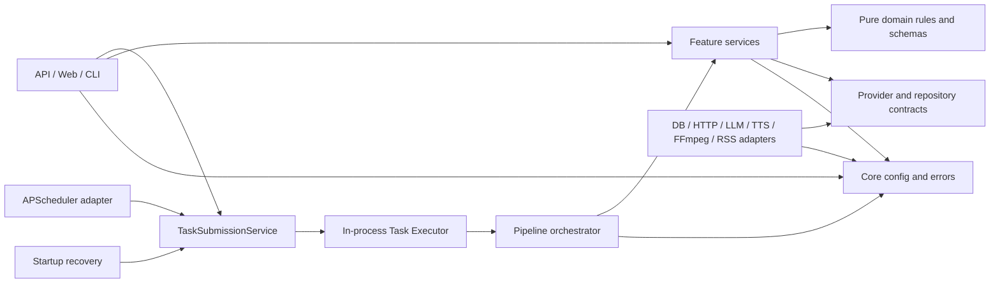

# DailyCast 推荐项目结构

## 1. 结构目标

DailyCast V1 采用 Python 单体模块化架构：一个可部署进程、一个 SQLite 数据库、一套媒体目录，但代码按业务能力拆分。结构应让管理 API、页面、调度器和 CLI 复用同一组应用服务，避免把业务逻辑堆在 FastAPI route 中，也避免为了形式引入多层实体转换和复杂 Clean Architecture 模板。

本阶段只定义结构，不创建这些源码、配置或测试文件。

## 2. 推荐目录树

```text
dailycast/
├── README.md
├── LICENSE
├── pyproject.toml
├── Dockerfile
├── .env.example
├── compose.yaml
├── alembic.ini
├── migrations/
│   ├── env.py
│   ├── script.py.mako
│   └── versions/
│       └── 0001_initial_schema.py
├── config/
│   ├── app.example.yaml
│   └── sources.example.yaml         # 首次/缺失项种子，不覆盖数据库修改
├── docs/
│   ├── PRD.md
│   ├── design.md
│   ├── data-model.md
│   ├── api.md
│   └── project-structure.md
├── src/
│   └── dailycast/
│       ├── __init__.py
│       ├── main.py
│       ├── cli.py
│       ├── core/
│       │   ├── config.py
│       │   ├── errors.py
│       │   ├── logging.py
│       │   ├── security.py
│       │   └── time.py
│       ├── db/
│       │   ├── base.py
│       │   ├── models.py
│       │   ├── session.py
│       │   ├── repositories.py       # 包含 LLMArtifactRepository
│       │   └── transactions.py
│       ├── sources/
│       │   ├── contracts.py
│       │   ├── service.py
│       │   ├── rss.py
│       │   ├── html_list.py
│       │   └── extraction.py
│       ├── news/
│       │   ├── types.py
│       │   ├── normalization.py
│       │   ├── filtering.py
│       │   ├── deduplication.py
│       │   ├── clustering.py
│       │   └── service.py
│       ├── llm/
│       │   ├── contracts.py
│       │   ├── schemas.py
│       │   ├── prompts.py
│       │   ├── budget.py
│       │   ├── artifacts.py
│       │   ├── editorial_service.py
│       │   └── providers/
│       │       └── openai_compatible.py
│       ├── episodes/
│       │   ├── types.py
│       │   ├── states.py
│       │   ├── service.py
│       │   ├── scripting.py
│       │   └── validation.py
│       ├── tts/
│       │   ├── contracts.py
│       │   ├── segmentation.py
│       │   ├── cache.py
│       │   ├── service.py
│       │   └── providers/
│       │       └── openai_compatible.py
│       ├── media/
│       │   ├── contracts.py
│       │   ├── filesystem.py
│       │   ├── ffmpeg.py
│       │   └── validation.py
│       ├── publishing/
│       │   ├── contracts.py
│       │   ├── service.py
│       │   └── rss.py
│       ├── pipeline/
│       │   ├── contracts.py
│       │   ├── context.py
│       │   ├── submission.py
│       │   ├── executor.py
│       │   ├── orchestrator.py
│       │   ├── idempotency.py
│       │   ├── recovery.py
│       │   └── steps/
│       │       ├── collect.py
│       │       ├── extract.py
│       │       ├── deduplicate.py
│       │       ├── cluster.py
│       │       ├── rank.py
│       │       ├── outline.py
│       │       ├── script.py
│       │       ├── check.py
│       │       ├── synthesize.py
│       │       ├── assemble.py
│       │       ├── review.py
│       │       └── publish.py
│       ├── scheduler/
│       │   ├── service.py
│       │   └── apscheduler_adapter.py
│       ├── api/
│       │   ├── dependencies.py
│       │   ├── errors.py
│       │   ├── schemas/
│       │   └── routes/
│       │       ├── health.py
│       │       ├── sources.py
│       │       ├── tasks.py
│       │       ├── articles.py
│       │       ├── events.py
│       │       ├── episodes.py
│       │       └── publications.py
│       └── web/
│           ├── routes.py
│           ├── view_models.py
│           ├── templates/
│           └── static/
├── tests/
│   ├── unit/
│   │   ├── news/
│   │   ├── llm/
│   │   ├── episodes/
│   │   ├── tts/
│   │   ├── publishing/
│   │   └── pipeline/
│   ├── integration/
│   │   ├── db/
│   │   │   ├── test_migrations.py
│   │   │   └── test_llm_artifacts.py
│   │   ├── sources/
│   │   ├── media/
│   │   ├── api/
│   │   └── rss/
│   ├── contract/
│   │   ├── llm/
│   │   ├── tts/
│   │   └── publishers/
│   ├── e2e/
│   │   └── test_daily_pipeline.py
│   ├── fixtures/
│   │   ├── feeds/
│   │   ├── html/
│   │   ├── llm_responses/
│   │   └── audio/
│   └── fakes/
│       ├── fake_llm.py
│       ├── fake_tts.py
│       └── fake_publisher.py
├── data/                    # 运行时目录，不提交内容
└── public/                  # 发布目录，不提交生成物
```

### 2.1 V1 监听与发布配置落点

- `config/app.example.yaml` 给非 Docker 开发提供 `server.host: 127.0.0.1`、`server.port: 8000` 默认值。
- `compose.yaml` 为同一配置显式覆盖容器内监听为 `0.0.0.0:8000`，并使用：

  ```yaml
  ports:
    - "127.0.0.1:8000:8000"
  ```

  容器内不能监听 `127.0.0.1`，否则宿主机映射不可达；宿主绑定为 loopback 则保证管理页面默认不对局域网/公网开放。
- `publishing.public_base_url` 和公开目录配置只决定 Feed/enclosure URL 与资产落点，不会改变管理服务监听地址。公网 RSS/media 由部署者在 Compose 外显式配置 HTTPS 反向代理、只读静态目录或受限端口；不得把整个管理 API 作为匿名公开面。
- localhost 本地开发允许 HTTP；任何非 loopback 的正式公开 Feed/media 使用 HTTPS。

## 3. 各目录职责

| 目录 | 职责 | 不应包含 |
|---|---|---|
| `core` | 配置加载、错误分类、结构化日志、URL 安全策略、可替换时钟 | 新闻选择、数据库查询、HTTP route |
| `db` | SQLAlchemy 模型、Session/事务、仓储查询、SQLite pragma | LLM/TTS 调用、状态机判断、HTTP schema |
| `migrations` | Alembic 环境和按 revision 管理的 SQLite schema 变更；初始 revision 创建全部 V1 表和索引 | 应用启动逻辑、运行时数据修补、`create_all()` |
| `sources` | 来源采集协议、RSS/HTML 列表发现、正文提取 | 去重、事件评分、节目创建 |
| `news` | URL/文本规范化、过滤、基础去重、语义聚类、事件构建 | 外部模型调用、音频、Web 响应 |
| `llm` | Provider 协议、版本化输入输出 schema、提示词、预算、LLMArtifact 缓存服务、编辑生成服务 | 任务调度、直接 SQL、音频处理 |
| `episodes` | 节目状态、Episode/EpisodeItem 用例、稿件修订和检查规则 | FastAPI、FFmpeg 命令细节、供应商 SDK |
| `tts` | TTS 协议、分段、缓存键、逐段合成和重试 | 最终公开 URL、Feed 生成 |
| `media` | 文件抽象、路径安全、FFmpeg 合并、音频校验、原子写 | 选题和发布状态决策 |
| `publishing` | Publisher 协议、发布前校验和 V1 RSS 实现 | 新闻理解、稿件生成、定时触发、V1 外部平台发布 |
| `pipeline` | 跨模块步骤编排、检查点、幂等、超时、失败恢复 | 供应商协议细节、HTML 页面 |
| `scheduler` | 将 Cron 触发转换为提交命令，只调用 `TaskSubmissionService`，维护单实例参数 | 直接调用 Orchestrator、实际流水线逻辑、业务数据加工 |
| `api` | JSON 请求校验、调用用例、状态码与响应映射 | SQL 查询拼装、Prompt、FFmpeg、重试循环 |
| `web` | Jinja2/HTMX 页面、展示 ViewModel、表单到用例的映射 | 独立业务实现、直接 Session 操作 |
| `tests` | 按测试层级验证规则、适配器契约和完整链路 | 真实生产密钥和不稳定公网依赖 |

## 4. 依赖方向



必须遵守以下方向：

1. `api`、`web`、`cli` 和 `scheduler` 是入口，只负责校验与调用；APScheduler、API 手动触发和 startup recovery 必须全部经 `TaskSubmissionService` 提交并竞争相同的数据库活动业务键，不能直接调用 Orchestrator。
2. `pipeline` 只通过 feature service 编排，不越过服务直接调用供应商 SDK。
3. 纯算法模块（规范化、过滤、聚类、分段、状态转换）不导入 FastAPI、APScheduler 或 SQLAlchemy Session。
4. 外部服务适配器实现本项目定义的协议；业务层不知道具体供应商响应格式。
5. 仓储是 SQLAlchemy 查询的唯一集中入口。API schema 不直接序列化 ORM 对象，先映射为响应 DTO。
6. 允许应用服务使用项目的 SQLAlchemy 实体类型，避免 V1 为每一层复制多套实体；但事务和查询仍封装在 repository/transaction boundary 中。
7. `migrations/` 由 Compose entrypoint 或开发者显式调用的 Alembic 管理；应用只检查 revision，不导入 migration 执行业务逻辑，也不调用 `Base.metadata.create_all()`。

## 5. 关键接口名称

### 5.1 新闻与采集

```text
SourceCollector.collect(source, window) -> CollectionResult
ContentExtractor.extract(url, fetch_policy) -> ExtractedArticle
ArticleRepository.upsert_candidate(candidate) -> Article
NewsProcessor.deduplicate(article_ids, policy) -> DedupResult
NewsProcessor.cluster(article_ids, policy) -> ClusterResult
```

`RSSCollector` 与 `HtmlListCollector` 实现 `SourceCollector`。采集输出统一的 `ArticleCandidate`，后续流程不关心入口类型。

### 5.2 LLM

```text
LLMProvider.generate_structured(request, response_schema) -> StructuredResult
LLMArtifactRepository.get_by_cache_identity(operation, provider, model, prompt_version, schema_version, generation_config_hash, input_hash) -> LLMArtifact | None
LLMArtifactRepository.insert_validated(artifact) -> LLMArtifact
LLMArtifactRepository.prune_before(cutoff, batch_size=500) -> int
AIEditorialService.score_events(event_cards, budget) -> EventScoreBatch
AIEditorialService.generate_outline(dossiers) -> EpisodeOutline
AIEditorialService.generate_script(outline, dossiers) -> EpisodeScript
AIEditorialService.generate_metadata(script) -> EpisodeMetadata
AIEditorialService.review_script(script, evidence) -> ScriptReview
```

业务级 `AIEditorialService` 负责构造受限输入与校验语义；`llm/artifacts.py` 计算完整七字段缓存身份并协调 repository，其中 `generation_config_hash` 覆盖脱敏 endpoint 身份和所有影响模型结果的非敏感生成选项。`LLMProvider` 只负责协议适配、超时、供应商错误映射和结构化响应。`LLMArtifactRepository.insert_validated` 只能接收已通过对应 schema 校验的 DTO；repository 查询不得省略 `generation_config_hash`，也不提供直接编辑/删除 Artifact 的管理接口。

### 5.3 TTS 与媒体

```text
TTSProvider.synthesize(segment_request) -> SynthesizedAudio
ScriptSegmenter.segment(script, limits) -> list[SegmentPlan]
AudioCache.find(cache_key, provider_config_hash, required_status="succeeded") -> AudioArtifact | None
MediaAssembler.merge(segments, output_spec) -> AudioArtifact
MediaStore.promote_draft(artifact, public_key) -> PublicAsset
```

`tts/cache.py` 以 `SHA-256(provider + provider_config_hash + model + voice + canonical_speed + format + segmenter_version + normalized_text)` 计算唯一 cache_key；`provider_config_hash` 负责 Provider 实现/脱敏 endpoint/额外音频语义选项。AudioCache 必须同时匹配完整 cache_key 和 provider_config_hash，并校验文件，不兼容旧的缺语义缓存键。

### 5.4 发布

```text
Publisher.validate(episode, asset) -> ValidationReport
Publisher.publish(publication_request) -> PublicationResult
Publisher.reconcile(publication) -> PublicationResult
```

V1 实现 `RSSPublisher`。未来的 `PodbeanAPIPublisher` 和 `NetEasePlaywrightPublisher` 使用相同输入，只接收已批准节目及不可变音频资产。

### 5.5 流水线

```text
PipelineStep.run(context) -> StepResult
TaskSubmissionService.submit(command) -> TaskRun
InProcessTaskExecutor.enqueue(task_run_id) -> None
InProcessTaskExecutor.shutdown(grace_seconds) -> None
PipelineOrchestrator.execute(task_run_id) -> TaskRun
IdempotencyService.acquire(business_key, idempotency_key) -> LeaseResult
RecoveryService.next_valid_step(task_run, current_inputs) -> StepName
```

`submission.py` 保证先提交 queued TaskRun 再 enqueue；`executor.py` 拥有有界队列、单并发槽、心跳和 SIGTERM 关闭；`orchestrator.py` 执行步骤。每个 `PipelineStep` 负责一个清晰检查点，返回输入/输出计数、artifact 引用、警告和错误分类，由 orchestrator 统一落库。

`scheduler/service.py` 和 `pipeline/recovery.py` 只构造提交命令并调用 `TaskSubmissionService.submit`；它们不得直接调用 `PipelineOrchestrator.execute`。数据库活动 business key 是 APScheduler、API 与恢复入口的共同防重复边界。

## 6. 业务逻辑不得进入 Route

Route 允许做：

- 解析路径、查询和 JSON body；
- 校验 `Idempotency-Key`、`If-Match` 等 HTTP 语义；
- 调用一个明确用例；
- 把领域错误映射为 HTTP 状态；
- 返回响应 DTO 或模板 ViewModel。

Route 禁止做：

- 构造 Prompt 或直接调用 LLM/TTS；
- 拼 SQLAlchemy 查询、提交事务或执行 migration；
- 实现状态迁移、重试、幂等或文件命名；
- 执行 FFmpeg、写 Feed、抓网页；
- 为 API 和管理页面复制两套业务流程。

## 7. 测试目录与覆盖重点

### `tests/unit`

测试纯规则和服务行为：

- URL 规范化、哈希、日期/长度过滤、SimHash/TF-IDF 聚类边界；
- 事件卡片裁剪、Token 预算和结构化模型响应校验；
- LLMArtifact 七字段缓存键、未校验结果拒绝保存和跨 TaskRun 复用；provider/model/Prompt/schema/input 以及 endpoint identity、temperature、top_p、max output tokens、response format/其他语义 model options 任一变化 cache miss，密钥/timeout/retry 不参与 `generation_config_hash`；
- Episode 状态迁移、稿件修订、数字/来源检查；
- 分段稳定性、包含 `provider_config_hash` 的完整缓存键和“只重生成变化片段”；验证 Provider 实现/endpoint、voice、speed、model、format/额外语义参数变化 cache miss，密钥/timeout/retry 不参与；
- 任务步骤依赖、超时判断、幂等业务键；
- RSS item/GUID/enclosure、publishing candidate 显式注入和重复 GUID 拒绝规则。

### `tests/integration`

使用临时 SQLite、临时媒体目录和本地固定响应服务器：

- Alembic 从空库 upgrade head、revision 检查、foreign keys、部分唯一索引、JSON check、包含 `generation_config_hash` 的 LLMArtifact 七字段唯一键和 Article/NewsEvent 循环外键；
- LLMArtifact exact-key 查询、JSON check、TaskRun/TaskStep 外键和并发插入；
- RSS/HTML fixture 采集、trafilatura 提取；
- FFmpeg 合并与 `ffprobe` 校验；
- FastAPI 路由、错误 envelope、分页与静态文件；
- Feed 原子替换与历史节目保留；覆盖“published 基础集合 + 当前 publishing candidate”，以及 Feed 替换后数据库提交前崩溃的 reconcile 补写且不重复资产/item；
- revision 不匹配时只允许 health/readiness 诊断端点，全部管理页面及业务读写/Feed/media 路由 fail closed；校验 Compose 容器监听 `0.0.0.0:8000` 且宿主端口绑定 `127.0.0.1:8000:8000`。

### `tests/contract`

所有 Provider 的共享契约测试。真实供应商 smoke test 只在显式环境变量存在时运行，默认 CI 跳过。

### `tests/e2e`

用 Fake LLM、Fake TTS、临时数据库和目录跑完整日任务，覆盖：正常生成、一个来源失败、TTS 中断续跑、人工批准、发布、重复发布。

## 8. 未来扩展落点

以下文件不属于 V1，不出现在当前目录树，也不应在项目骨架阶段创建：

- 真正接入 Dify 时，在 `src/dailycast/llm/providers/dify_workflow.py` 实现现有 `LLMProvider`，继续使用同一结构化 schema 和 LLMArtifact 缓存身份。
- 真正接入 Podbean 官方 API 时，在 `src/dailycast/publishing/providers/podbean_api.py` 实现现有 `Publisher`；届时再创建 `providers/` 目录和相应 Alembic revision。
- 真正进入网易云 RPA 阶段时，在 `src/dailycast/publishing/providers/netease_playwright.py` 实现现有 `Publisher`，并在该阶段才把 Playwright 加入可选依赖。

这些扩展只能在对应阶段具备可运行实现和测试时加入，不能以空文件表示支持。

## 9. V1 应避免的结构

- 不创建单独 API 服务和 Worker 服务；
- 不创建 `interfaces/use_cases/entities/gateways` 等四层镜像目录；
- 不为每个数据库实体复制 domain/entity/DTO 三套类；
- 不建立通用事件总线、插件市场或动态依赖注入容器；
- 不让 `utils.py` 成为无边界杂物箱；可复用能力必须归属具体模块；
- 不创建未来 Provider 的空文件或不可运行实现；接口和“未来扩展落点”说明足以预留边界。
